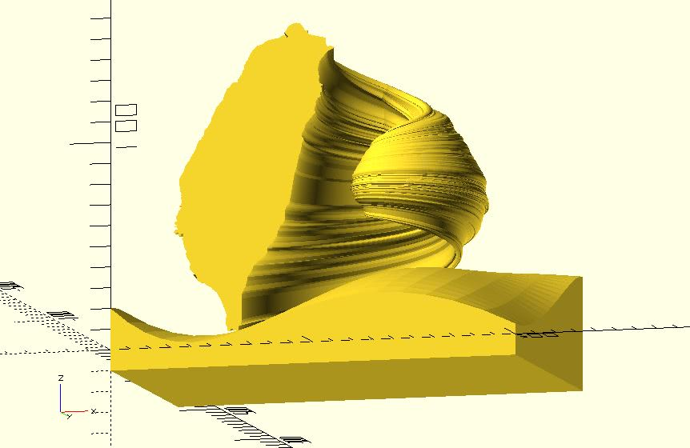

# dotSCAD (Beta)

> These fundamental modules and functions are helpful when playing OpenSCAD.

## Introduction

OpenSCAD uses three library locations, the installation library, built-in library, and user defined libraries. It's convenient to set `OPENSCADPATH`. Check [Setting OPENSCADPATH](https://en.wikibooks.org/wiki/OpenSCAD_User_Manual/Libraries#Setting_OPENSCADPATH) in [OpenSCAD User Manual/Libraries](https://en.wikibooks.org/wiki/OpenSCAD_User_Manual/Libraries) for details.

Every module or function is located in the file which has the same name as the module or the function. For example, if you want to use the `line2d` module to draw a line, `include <line2d.scad>;` first. 

	include <line2d.scad>;

	line2d(p1 = [0, 0], p2 = [5, 0], width = 1);

Some modules may depend on other modules. For example, the `polyline2d` module depends on the `line2d` module, so you also have to `include <line2d.scad>;` besides `include <polyline3d.scad>;`. 

	include <line2d.scad>;
	include <polyline3d.scad>;

	polyline2d(points = [[1, 2], [-5, -4], [-5, 3], [5, 5]], width = 1);

If OpenSCAD generates "WARNING: Ignoring unknown xxx function" or "WARNING: Ignoring unknown xxx module" when using one module of dotSCAD. Just try to `include <xxx.scad>;`.

Too many dependencies? Because OpenSCAD doesn't provide namespace management, I personally think that exposing dependencies is better than hiding them. In this way, users can have their own way to manage dependencies. How to categorize dependencies is up to you. For example, you can include your commonly-used modules and functions in "commonly_used.scad" and then `include <commonly_used.scad>;` in the ".scad" file of your project.

## Documentation

- 2D
    - [arc](https://openhome.cc/eGossip/OpenSCAD/lib-arc.html)
	- [pie](https://openhome.cc/eGossip/OpenSCAD/lib-pie.html)
	- [rounded_square](https://openhome.cc/eGossip/OpenSCAD/lib-rounded_square.html)
	- [line2d](https://openhome.cc/eGossip/OpenSCAD/lib-line2d.html)
	- [polyline2d](https://openhome.cc/eGossip/OpenSCAD/lib-polyline2d.html)
	- [hull_polyline2d](https://openhome.cc/eGossip/OpenSCAD/lib-hull_polyline2d.html)
	- [hexagons](https://openhome.cc/eGossip/OpenSCAD/lib-hexagons.html)
	- [polytransversals](https://openhome.cc/eGossip/OpenSCAD/lib-polytransversals.html)
	- [path_extend](https://openhome.cc/eGossip/OpenSCAD/lib-path_extend.html)

- 3D
	- [rounded_cube](https://openhome.cc/eGossip/OpenSCAD/lib-rounded_cube.html)
    - [rounded_cylinder](https://openhome.cc/eGossip/OpenSCAD/lib-rounded_cylinder.html)
	- [line3d](https://openhome.cc/eGossip/OpenSCAD/lib-line3d.html)
	- [polyline3d](https://openhome.cc/eGossip/OpenSCAD/lib-polyline3d.html)
	- [hull_polyline3d](https://openhome.cc/eGossip/OpenSCAD/lib-hull_polyline3d.html)
	- [function_grapher](https://openhome.cc/eGossip/OpenSCAD/lib-function_grapher.html)
	- [polysections](https://openhome.cc/eGossip/OpenSCAD/lib-polysections.html)
	
- Transformation
    - [along_with](https://openhome.cc/eGossip/OpenSCAD/lib-along_with.html)
	- [hollow_out](https://openhome.cc/eGossip/OpenSCAD/lib-hollow_out.html)
	- [bend](https://openhome.cc/eGossip/OpenSCAD/lib-bend.html)

- Functon
	- [rotate_p](https://openhome.cc/eGossip/OpenSCAD/lib-rotate_p.html)
	- [sub_str](https://openhome.cc/eGossip/OpenSCAD/lib-sub_str.html)
	- [split_str](https://openhome.cc/eGossip/OpenSCAD/lib-split_str.html)
	- [parse_number](https://openhome.cc/eGossip/OpenSCAD/lib-parse_number.html)
	- [cross_sections](https://openhome.cc/eGossip/OpenSCAD/lib-cross_sections.html)
	
- Path
    - [circle_path](https://openhome.cc/eGossip/OpenSCAD/lib-circle_path.html)
    - [bezier_curve](https://openhome.cc/eGossip/OpenSCAD/lib-bezier_curve.html)
	- [bezier_surface](https://openhome.cc/eGossip/OpenSCAD/lib-bezier_surface.html)
    - [helix](https://openhome.cc/eGossip/OpenSCAD/lib-helix.html)
    - [golden_spiral](https://openhome.cc/eGossip/OpenSCAD/lib-golden_spiral.html)
    - [archimedean_spiral](https://openhome.cc/eGossip/OpenSCAD/lib-archimedean_spiral.html)
    - [sphere_spiral](https://openhome.cc/eGossip/OpenSCAD/lib-sphere_spiral.html)

- Extrusion
    - [box_extrude](https://openhome.cc/eGossip/OpenSCAD/lib-box_extrude.html)
	- [ellipse_extrude](https://openhome.cc/eGossip/OpenSCAD/lib-ellipse_extrude.html)
    - [stereographic_extrude](https://openhome.cc/eGossip/OpenSCAD/lib-stereographic_extrude.html)
	- [path_extrude](https://openhome.cc/eGossip/OpenSCAD/lib-path_extrude.html)
	- [ring_extrude](https://openhome.cc/eGossip/OpenSCAD/lib-ring_extrude.html)
	- [helix_extrude](https://openhome.cc/eGossip/OpenSCAD/lib-helix_extrude.html)
	- [golden_spiral_extrude](https://openhome.cc/eGossip/OpenSCAD/lib-golden_spiral_extrude.html)
	- [archimedean_spiral_extrude](https://openhome.cc/eGossip/OpenSCAD/lib-archimedean_spiral_extrude.html)
	- [sphere_spiral_extrude](https://openhome.cc/eGossip/OpenSCAD/lib-sphere_spiral_extrude.html)

- Shape
    - [shape_taiwan](https://openhome.cc/eGossip/OpenSCAD/lib-shape_taiwan.html)
	- [shape_arc](https://openhome.cc/eGossip/OpenSCAD/lib-shape_arc.html)
	- [shape_pie](https://openhome.cc/eGossip/OpenSCAD/lib-shape_pie.html)
	- [shape_ellipse](https://openhome.cc/eGossip/OpenSCAD/lib-shape_ellipse.html)
    - [shape_square](https://openhome.cc/eGossip/OpenSCAD/lib-shape_square.html)
	- [shape_trapezium](https://openhome.cc/eGossip/OpenSCAD/lib-shape_trapezium.html)
    - [shape_pentagram](https://openhome.cc/eGossip/OpenSCAD/lib-shape_pentagram.html)	
	- [shape_superformula](https://openhome.cc/eGossip/OpenSCAD/lib-shape_superformula.html)	
	
- Other
    - [turtle2d](https://openhome.cc/eGossip/OpenSCAD/lib-turtle2d.html)
    - [turtle3d](https://openhome.cc/eGossip/OpenSCAD/lib-turtle3d.html)
	- [log](https://openhome.cc/eGossip/OpenSCAD/lib-log.html)

## Bugs and Feedback

For bugs, questions and discussions please use the [Github Issues](https://github.com/JustinSDK/dotSCAD/issues).

## About dotSCAD

I've been using OpenSCAD for years and created some funny things. Some of them include several important ideas and details. To prevent forgetfulness, I decided to [write them down](https://openhome.cc/eGossip/OpenSCAD/). Some examples developed in the documentation are useful so I elaborate them into this library.

The idea of the name dotSCAD comes from the filename extension ".scad" of OpenSCAD. 