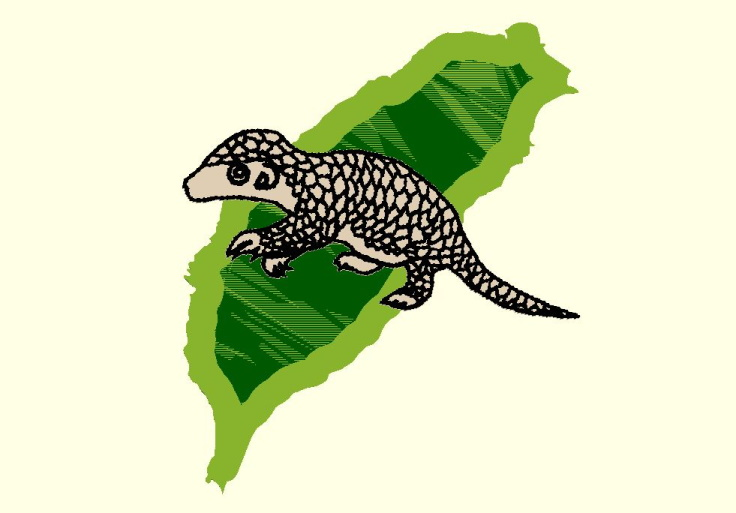
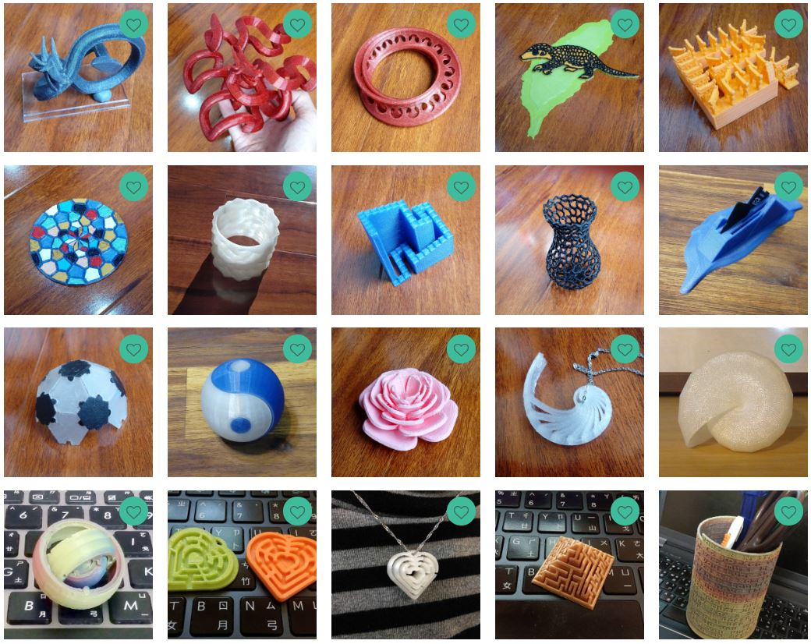

# dotSCAD 2.3

> **Reduce the burden of mathematics when playing OpenSCAD.**

## Introduction

**Based on OpenSCAD 2019.05.** 

OpenSCAD uses three library locations, the installation library, built-in library, and user defined libraries. It's convenient to set `OPENSCADPATH`. Check [Setting OPENSCADPATH](https://en.wikibooks.org/wiki/OpenSCAD_User_Manual/Libraries#Setting_OPENSCADPATH) in [OpenSCAD User Manual/Libraries](https://en.wikibooks.org/wiki/OpenSCAD_User_Manual/Libraries) for details.

Every module or function is located in the file which has the same name as the module or the function. For example, if you want to use the `line2d` module to draw a line, `use <line2d.scad>;` first. 

	use <line2d.scad>;

	line2d(p1 = [0, 0], p2 = [5, 0], width = 1);

**I set `OPENSCADPATH` to the `src` folder of dotSCAD so all examples here start searching modules or functions from `src`. If you put dotSCAD in the `libraries` of OpenSCAD, you'll have to prefix `dotSCAD/src` when using them. For example, `use <dotSCAD/src/line2d.scad>;`**

Some module files are organized in a directory. For example, px_circle.scad exists in `pixel` directory. You have to prefix the directory name when including `px_circle`.

    use <pixel/px_circle.scad>;
	
	points = px_circle(radius = 10);
	for(pt = points) {
        translate(pt) square(1);
	}

## Examples

See [examples](examples).

## Documentation

### 2D Module
- [arc](https://openhome.cc/eGossip/OpenSCAD/lib2x-arc.html)
- [pie](https://openhome.cc/eGossip/OpenSCAD/lib2x-pie.html)
- [rounded_square](https://openhome.cc/eGossip/OpenSCAD/lib2x-rounded_square.html)
- [line2d](https://openhome.cc/eGossip/OpenSCAD/lib2x-line2d.html)
- [polyline2d](https://openhome.cc/eGossip/OpenSCAD/lib2x-polyline2d.html)
- [hull_polyline2d](https://openhome.cc/eGossip/OpenSCAD/lib2x-hull_polyline2d.html)
- [hexagons](https://openhome.cc/eGossip/OpenSCAD/lib2x-hexagons.html)
- [polytransversals](https://openhome.cc/eGossip/OpenSCAD/lib2x-polytransversals.html)
- [multi_line_text](https://openhome.cc/eGossip/OpenSCAD/lib2x-multi_line_text.html)
- [voronoi2d](https://openhome.cc/eGossip/OpenSCAD/lib2x-voronoi2d.html)

### 3D Module
- [rounded_cube](https://openhome.cc/eGossip/OpenSCAD/lib2x-rounded_cube.html)
- [rounded_cylinder](https://openhome.cc/eGossip/OpenSCAD/lib2x-rounded_cylinder.html)
- [crystal_ball](https://openhome.cc/eGossip/OpenSCAD/lib2x-crystal_ball.html)
- [line3d](https://openhome.cc/eGossip/OpenSCAD/lib2x-line3d.html)
- [polyline3d](https://openhome.cc/eGossip/OpenSCAD/lib2x-polyline3d.html)
- [hull_polyline3d](https://openhome.cc/eGossip/OpenSCAD/lib2x-hull_polyline3d.html)
- [function_grapher](https://openhome.cc/eGossip/OpenSCAD/lib2x-function_grapher.html)
- [sweep](https://openhome.cc/eGossip/OpenSCAD/lib2x-sweep.html)
- [loft](https://openhome.cc/eGossip/OpenSCAD/lib2x-loft.html)
- [starburst](https://openhome.cc/eGossip/OpenSCAD/lib2x-starburst.html)
- [voronoi3d](https://openhome.cc/eGossip/OpenSCAD/lib2x-voronoi3d.html)

### Transformation
- [along_with](https://openhome.cc/eGossip/OpenSCAD/lib2x-along_with.html)
- [hollow_out](https://openhome.cc/eGossip/OpenSCAD/lib2x-hollow_out.html)
- [bend](https://openhome.cc/eGossip/OpenSCAD/lib2x-bend.html)
- [shear](https://openhome.cc/eGossip/OpenSCAD/lib2x-shear.html)

### 2D Function
- [in_shape](https://openhome.cc/eGossip/OpenSCAD/lib2x-in_shape.html)
- [bijection_offset](https://openhome.cc/eGossip/OpenSCAD/lib2x-bijection_offset.html)	
- [trim_shape](https://openhome.cc/eGossip/OpenSCAD/lib2x-trim_shape.html)
- [triangulate](https://openhome.cc/eGossip/OpenSCAD/lib2x-triangulate.html)
- [contours](https://openhome.cc/eGossip/OpenSCAD/lib2x-contours.html)

### 2D/3D Function
- [cross_sections](https://openhome.cc/eGossip/OpenSCAD/lib2x-cross_sections.html)
- [paths2sections](https://openhome.cc/eGossip/OpenSCAD/lib2x-paths2sections.html)
- [path_scaling_sections](https://openhome.cc/eGossip/OpenSCAD/lib2x-path_scaling_sections.html)
- [bezier_surface](https://openhome.cc/eGossip/OpenSCAD/lib2x-bezier_surface.html)	
- [bezier_smooth](https://openhome.cc/eGossip/OpenSCAD/lib2x-bezier_smooth.html)	
- [midpt_smooth](https://openhome.cc/eGossip/OpenSCAD/lib2x-midpt_smooth.html)
- [in_polyline](https://openhome.cc/eGossip/OpenSCAD/lib2x-in_polyline.html)

### Path
- [arc_path](https://openhome.cc/eGossip/OpenSCAD/lib2x-arc_path.html)
- [bspline_curve](https://openhome.cc/eGossip/OpenSCAD/lib2x-bspline_curve.html)
- [bezier_curve](https://openhome.cc/eGossip/OpenSCAD/lib2x-bezier_curve.html)
- [helix](https://openhome.cc/eGossip/OpenSCAD/lib2x-helix.html)
- [golden_spiral](https://openhome.cc/eGossip/OpenSCAD/lib2x-golden_spiral.html)
- [archimedean_spiral](https://openhome.cc/eGossip/OpenSCAD/lib2x-archimedean_spiral.html)
- [sphere_spiral](https://openhome.cc/eGossip/OpenSCAD/lib2x-sphere_spiral.html)
- [torus_knot](https://openhome.cc/eGossip/OpenSCAD/lib2x-torus_knot.html)

### Extrusion
- [box_extrude](https://openhome.cc/eGossip/OpenSCAD/lib2x-box_extrude.html)
- [ellipse_extrude](https://openhome.cc/eGossip/OpenSCAD/lib2x-ellipse_extrude.html)
- [stereographic_extrude](https://openhome.cc/eGossip/OpenSCAD/lib2x-stereographic_extrude.html)
- [rounded_extrude](https://openhome.cc/eGossip/OpenSCAD/lib2x-rounded_extrude.html)
- [bend_extrude](https://openhome.cc/eGossip/OpenSCAD/lib2x-bend_extrude.html)	

### 2D Shape
- [shape_taiwan](https://openhome.cc/eGossip/OpenSCAD/lib2x-shape_taiwan.html)
- [shape_arc](https://openhome.cc/eGossip/OpenSCAD/lib2x-shape_arc.html)
- [shape_pie](https://openhome.cc/eGossip/OpenSCAD/lib2x-shape_pie.html)
- [shape_circle](https://openhome.cc/eGossip/OpenSCAD/lib2x-shape_circle.html)
- [shape_ellipse](https://openhome.cc/eGossip/OpenSCAD/lib2x-shape_ellipse.html)
- [shape_square](https://openhome.cc/eGossip/OpenSCAD/lib2x-shape_square.html)
- [shape_trapezium](https://openhome.cc/eGossip/OpenSCAD/lib2x-shape_trapezium.html)
- [shape_cyclicpolygon](https://openhome.cc/eGossip/OpenSCAD/lib2x-shape_cyclicpolygon.html)
- [shape_pentagram](https://openhome.cc/eGossip/OpenSCAD/lib2x-shape_pentagram.html)	
- [shape_starburst](https://openhome.cc/eGossip/OpenSCAD/lib2x-shape_starburst.html)	    
- [shape_superformula](https://openhome.cc/eGossip/OpenSCAD/lib2x-shape_superformula.html)
- [shape_glued2circles](https://openhome.cc/eGossip/OpenSCAD/lib2x-shape_glued2circles.html)
- [shape_path_extend](https://openhome.cc/eGossip/OpenSCAD/lib2x-shape_path_extend.html)

### 2D Shape Extrusion
- [path_extrude](https://openhome.cc/eGossip/OpenSCAD/lib2x-path_extrude.html)
- [ring_extrude](https://openhome.cc/eGossip/OpenSCAD/lib2x-ring_extrude.html)
- [helix_extrude](https://openhome.cc/eGossip/OpenSCAD/lib2x-helix_extrude.html)
- [golden_spiral_extrude](https://openhome.cc/eGossip/OpenSCAD/lib2x-golden_spiral_extrude.html)
- [archimedean_spiral_extrude](https://openhome.cc/eGossip/OpenSCAD/lib2x-archimedean_spiral_extrude.html)
- [sphere_spiral_extrude](https://openhome.cc/eGossip/OpenSCAD/lib2x-sphere_spiral_extrude.html)

### Util
- [util/sub_str](https://openhome.cc/eGossip/OpenSCAD/lib2x-sub_str.html)
- [util/split_str](https://openhome.cc/eGossip/OpenSCAD/lib2x-split_str.html)
- [util/parse_number](https://openhome.cc/eGossip/OpenSCAD/lib2x-parse_number.html)
- [util/reverse](https://openhome.cc/eGossip/OpenSCAD/lib2x-reverse.html)
- [util/slice](https://openhome.cc/eGossip/OpenSCAD/lib2x-slice.html)
- [util/sort](https://openhome.cc/eGossip/OpenSCAD/lib2x-sort.html)
- [util/rand](https://openhome.cc/eGossip/OpenSCAD/lib2x-rand.html)
- [util/fibseq](https://openhome.cc/eGossip/OpenSCAD/lib2x-fibseq.html)	
- [util/bsearch](https://openhome.cc/eGossip/OpenSCAD/lib2x-bsearch.html)	
- [util/has](https://openhome.cc/eGossip/OpenSCAD/lib2x-has.html)
- [util/dedup](https://openhome.cc/eGossip/OpenSCAD/lib2x-dedup.html)
- [util/flat](https://openhome.cc/eGossip/OpenSCAD/lib2x-flat.html)

### Matrix
- [matrix/m_cumulate](https://openhome.cc/eGossip/OpenSCAD/lib2x-m_cumulate.html)	
- [matrix/m_translation](https://openhome.cc/eGossip/OpenSCAD/lib2x-m_translation.html)
- [matrix/m_rotation](https://openhome.cc/eGossip/OpenSCAD/lib2x-m_rotation.html)
- [matrix/m_scaling](https://openhome.cc/eGossip/OpenSCAD/lib2x-m_scaling.html)
- [matrix/m_mirror](https://openhome.cc/eGossip/OpenSCAD/lib2x-m_mirror.html)
- [matrix/m_shearing](https://openhome.cc/eGossip/OpenSCAD/lib2x-m_shearing.html)

### Point Transformation
- [ptf/ptf_rotate](https://openhome.cc/eGossip/OpenSCAD/lib2x-ptf_rotate.html)
- [ptf/ptf_x_twist](https://openhome.cc/eGossip/OpenSCAD/lib2x-ptf_x_twist.html)
- [ptf/ptf_y_twist](https://openhome.cc/eGossip/OpenSCAD/lib2x-ptf_y_twist.html)
- [ptf/ptf_circle](https://openhome.cc/eGossip/OpenSCAD/lib2x-ptf_circle.html)
- [ptf/ptf_bend](https://openhome.cc/eGossip/OpenSCAD/lib2x-ptf_bend.html)
- [ptf/ptf_ring](https://openhome.cc/eGossip/OpenSCAD/lib2x-ptf_ring.html)
- [ptf/ptf_sphere](https://openhome.cc/eGossip/OpenSCAD/lib2x-ptf_sphere.html)
- [ptf/ptf_torus](https://openhome.cc/eGossip/OpenSCAD/lib2x-ptf_torus.html)

----

### Turtle
- [turtle/turtle2d](https://openhome.cc/eGossip/OpenSCAD/lib2x-turtle2d.html)
- [turtle/turtle3d](https://openhome.cc/eGossip/OpenSCAD/lib2x-turtle3d.html)
- [turtle/t2d](https://openhome.cc/eGossip/OpenSCAD/lib2x-t2d.html)
- [turtle/t3d](https://openhome.cc/eGossip/OpenSCAD/lib2x-t3d.html)

### Pixel
- [pixel/px_line](https://openhome.cc/eGossip/OpenSCAD/lib2x-px_line.html)
- [pixel/px_polyline](https://openhome.cc/eGossip/OpenSCAD/lib2x-px_polyline.html)
- [pixel/px_circle](https://openhome.cc/eGossip/OpenSCAD/lib2x-px_circle.html)
- [pixel/px_cylinder](https://openhome.cc/eGossip/OpenSCAD/lib2x-px_cylinder.html)
- [pixel/px_sphere](https://openhome.cc/eGossip/OpenSCAD/lib2x-px_sphere.html)
- [pixel/px_polygon](https://openhome.cc/eGossip/OpenSCAD/lib2x-px_polygon.html)
- [pixel/px_from](https://openhome.cc/eGossip/OpenSCAD/lib2x-px_from.html)
- [pixel/px_ascii](https://openhome.cc/eGossip/OpenSCAD/lib2x-px_ascii.html)
- [pixel/px_gray](https://openhome.cc/eGossip/OpenSCAD/lib2x-px_gray.html)

### Part
- [part/connector_peg](https://openhome.cc/eGossip/OpenSCAD/lib2x-connector_peg.html)
- [part/cone](https://openhome.cc/eGossip/OpenSCAD/lib2x-cone.html)
- [part/joint_T](https://openhome.cc/eGossip/OpenSCAD/lib2x-joint_T.html)

### Surface
- [surface/sf_square](https://openhome.cc/eGossip/OpenSCAD/lib2x-sf_square.html)
- [surface/sf_bend](https://openhome.cc/eGossip/OpenSCAD/lib2x-sf_bend.html)
- [surface/sf_ring](https://openhome.cc/eGossip/OpenSCAD/lib2x-sf_ring.html)
- [surface/sf_sphere](https://openhome.cc/eGossip/OpenSCAD/lib2x-sf_sphere.html)
- [surface/sf_torus](https://openhome.cc/eGossip/OpenSCAD/lib2x-sf_torus.html)
- [surface/sf_solidify](https://openhome.cc/eGossip/OpenSCAD/lib2x-sf_solidify.html)

### Noise
- [noise/nz_perlin1](https://openhome.cc/eGossip/OpenSCAD/lib2x-nz_perlin1.html)
- [noise/nz_perlin1s](https://openhome.cc/eGossip/OpenSCAD/lib2x-nz_perlin1s.html)
- [noise/nz_perlin2](https://openhome.cc/eGossip/OpenSCAD/lib2x-nz_perlin2.html)
- [noise/nz_perlin2s](https://openhome.cc/eGossip/OpenSCAD/lib2x-nz_perlin2s.html)
- [noise/nz_perlin3](https://openhome.cc/eGossip/OpenSCAD/lib2x-nz_perlin3.html)
- [noise/nz_perlin3s](https://openhome.cc/eGossip/OpenSCAD/lib2x-nz_perlin3s.html)
- [noise/nz_worley2](https://openhome.cc/eGossip/OpenSCAD/lib2x-nz_worley2.html)
- [noise/nz_worley2s](https://openhome.cc/eGossip/OpenSCAD/lib2x-nz_worley2s.html)
- [noise/nz_worley3](https://openhome.cc/eGossip/OpenSCAD/lib2x-nz_worley3.html)
- [noise/nz_worley3s](https://openhome.cc/eGossip/OpenSCAD/lib2x-nz_worley3s.html)
- [noise/nz_cell](https://openhome.cc/eGossip/OpenSCAD/lib2x-nz_cell.html)

----

# 2.4 Preview

### 2D Function
- [lines_intersection](https://openhome.cc/eGossip/OpenSCAD/lib2x-lines_intersection.html)

### Util
- [util/sum](https://openhome.cc/eGossip/OpenSCAD/lib2x-sum.html)
- [util/zip](https://openhome.cc/eGossip/OpenSCAD/lib2x-zip.html)

### Turtle
- [turtle/footprints2](https://openhome.cc/eGossip/OpenSCAD/lib2x-footprints2.html)
- [turtle/footprints3](https://openhome.cc/eGossip/OpenSCAD/lib2x-footprints3.html)
- [turtle/lsystem2](https://openhome.cc/eGossip/OpenSCAD/lib2x-lsystem2.html)
- [turtle/lsystem3](https://openhome.cc/eGossip/OpenSCAD/lib2x-lsystem3.html)

### Voxel (Renamed from Pixel. Yes, Pixel will be deprecated in the next release.)
- [voxel/vx_line](https://openhome.cc/eGossip/OpenSCAD/lib2x-vx_line.html)
- [voxel/vx_polyline](https://openhome.cc/eGossip/OpenSCAD/lib2x-vx_polyline.html)
- [voxel/vx_circle](https://openhome.cc/eGossip/OpenSCAD/lib2x-vx_circle.html)
- [voxel/vx_cylinder](https://openhome.cc/eGossip/OpenSCAD/lib2x-vx_cylinder.html)
- [voxel/vx_sphere](https://openhome.cc/eGossip/OpenSCAD/lib2x-vx_sphere.html)
- [voxel/vx_polygon](https://openhome.cc/eGossip/OpenSCAD/lib2x-vx_polygon.html)
- [voxel/vx_from](https://openhome.cc/eGossip/OpenSCAD/lib2x-vx_from.html)
- [voxel/vx_ascii](https://openhome.cc/eGossip/OpenSCAD/lib2x-vx_ascii.html)
- [voxel/vx_gray](https://openhome.cc/eGossip/OpenSCAD/lib2x-vx_gray.html)
- [voxel/vx_union](https://openhome.cc/eGossip/OpenSCAD/lib2x-vx_union.html)
- [voxel/vx_intersection](https://openhome.cc/eGossip/OpenSCAD/lib2x-vx_intersection.html)
- [voxel/vx_difference](https://openhome.cc/eGossip/OpenSCAD/lib2x-vx_difference.html)

### Matrix
- [matrix/m_determinant](https://openhome.cc/eGossip/OpenSCAD/lib2x-m_determinant.html)

### Voronoi
- [voronoi/vrn2_from](https://openhome.cc/eGossip/OpenSCAD/lib2x-vrn2_from.html)
- [voronoi/vrn2_space](https://openhome.cc/eGossip/OpenSCAD/lib2x-vrn2_space.html)
- [voronoi/vrn2_cells_from](https://openhome.cc/eGossip/OpenSCAD/lib2x-vrn2_cells_from.html)
- [voronoi/vrn2_cells_space](https://openhome.cc/eGossip/OpenSCAD/lib2x-vrn2_cells_space.html)
- [voronoi/vrn3_from](https://openhome.cc/eGossip/OpenSCAD/lib2x-vrn3_from.html)
- voronoi/vrn3_space

----

## Bugs and Feedback

For bugs, questions and discussions please use the [Github Issues](https://github.com/JustinSDK/dotSCAD/issues).

## About dotSCAD

I've been using OpenSCAD for years. Some of [my works](https://github.com/JustinSDK/dotSCAD/tree/master/examples) include reusable implementations so I elaborate them into this library.

The idea of the name dotSCAD comes from the filename extension ".scad" of OpenSCAD. 