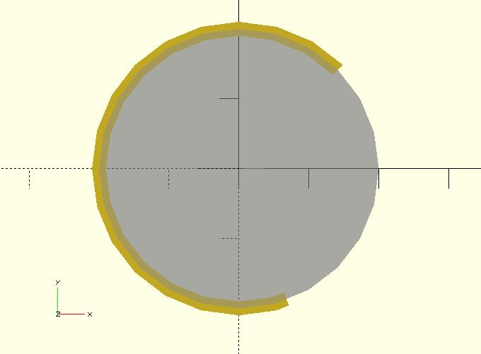
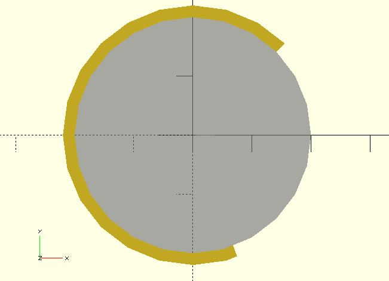

# arc

Create an arc. You can pass a 2 element vector to define the central angle. Its `$fa`, `$fs` and `$fn` parameters are consistent with the circle module. It depends on the `circular_sector` module so you have to include circular_sector.scad.

## Parameters

- `radius` : The radius of the circle.
- `angles` : A 2 element vector which defines the central angle. The first element of the vector is the beginning angle in degrees, and the second element is the ending angle.
- `width_mode` : The default value is `"LINE_CROSS"`. The arc line will move outward by `width / 2` and inward by `width / 2`. If it's `"LINE_OUTWARD"`, the arc line moves outward by `width`. The `"LINE_INWARD"` moves the arc line inward by `width`.

## Examples
    
    $fn = 24;
    arc(radius = 20, angles = [45, 290], width = 2);
    %circle(r = 20); 

    arc(radius = 20, angles = [45, 290], width = 2, width_mode = "LINE_INWARD");
    %circle(r = 20); 

    arc(radius = 20, angles = [45, 290], width = 2, width_mode = "LINE_OUTWARD");
    %circle(r = 20); 

