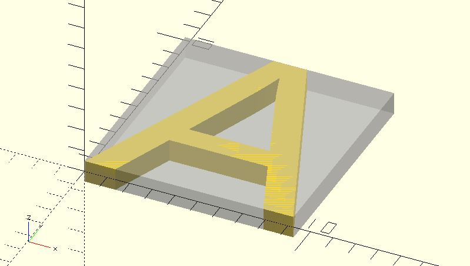
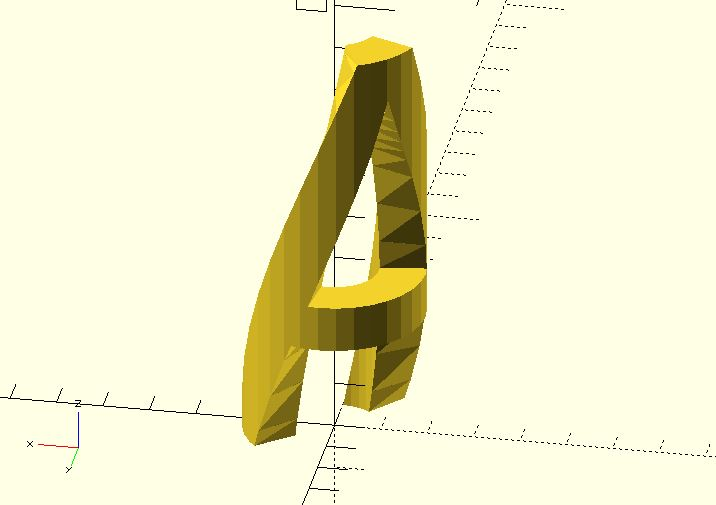
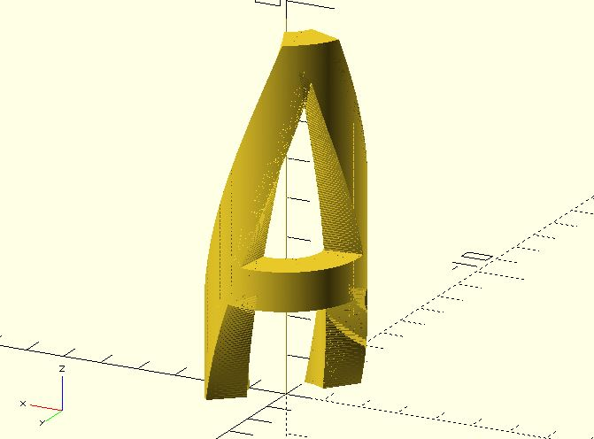

# bend_extrude

The purpose of `bend_extrude` is to replace `bend` when you have a 2D shape. `bend_extrude` is faster and doesn't produce jagged edges.

**Since 1.3**

## Parameters

- `size` : The size of a square which can contain the target shape.
- `thickness` : The thinkness used to extrude the shape.
- `angle` : The central angle of the arc shape. The radius of the arc is calculated automatically.
- `frags` : Number of fragments. The target shape will be cut into `frags` fragments and recombined into an arc object. The default value is 24.

## Examples

The containing square of the target shape should be laid down on the x-y plane. For example.

	include <bend_extrude.scad>;

	x = 9.25;
	y = 9.55;

	%square(size = [x, y]);
	text("A");

Once you have the size of the containing square, you can use it as the `size` argument of the `bend_extrude` module.

    include <bend.scad>;

	x = 9.25;
	y = 9.55;
	z = 1;  
	       
	*cube(size = [x, y, z]);
	
	bend(size = [x, y, z], angle = 270)
	    linear_extrude(z) text("A");

The arc shape is smoother if the `frags` value is larger. 

    include <bend.scad>;
	
	x = 9.25;
	y = 9.55;
	z = 1;  
	
	bend(size = [x, y, z], angle = 270, frags = 360)
	    linear_extrude(z) 
	        text("A");

This module is especially useful when you want to create things such as [Voronoi bracelet](https://www.thingiverse.com/thing:3650115).
