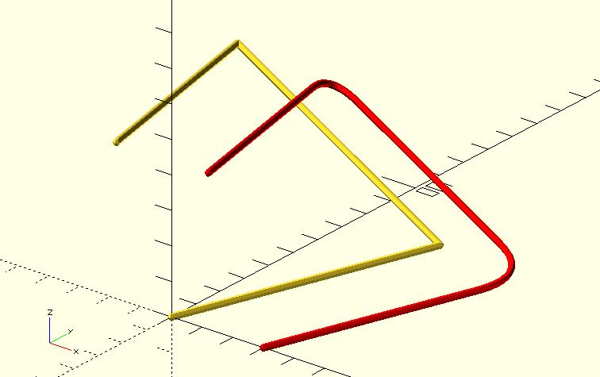
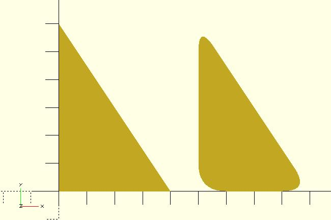

# bezier_smooth

Given a path, the bezier_smooth function uses bazier curves to smooth all corners. You can use it to create smoothier lines or rounded shapes.

Dependencies: the `bezier_curve` function.

## Parameters

- `path_pts` : A list of points represent the path.
- `round_d` : Used to create the other two control points at the corner.
- `t_step` : The distance between two points of the Bézier path at the corner. It defaults to 0.1.
- `closed` : It defaults to `false`. If you have a closed path, set it to `true`.

## Examples

	include <hull_polyline3d.scad>;
	include <bezier_curve.scad>;
	include <bezier_smooth.scad>;

	width = 2;
	round_d = 15;

	path_pts = [
		[0, 0, 0],
		[40, 60, 10],
		[-50, 90, 30],
		[-10, -10, 50]
	];

	hull_polyline3d(
		path_pts, width
	);

	smoothed_path_pts = bezier_smooth(path_pts, round_d);

	color("red") translate([30, 0, 0]) hull_polyline3d(
		smoothed_path_pts, width
	);

	include <bezier_curve.scad>;
	include <bezier_smooth.scad>;

	round_d = 10;

	path_pts = [
		[0, 0],
		[40, 0],
		[0, 60]
	];

	polygon(path_pts);

	smoothed_path_pts = bezier_smooth(path_pts, round_d, closed = true);

	translate([50, 0, 0]) polygon(smoothed_path_pts);

