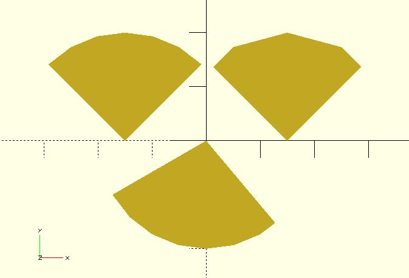

# circular_sector

Creates a circular sector. You can pass a 2 element vector to define the central angle. Its `$fa`, `$fs` and `$fn` parameters are consistent with the circle module.

## Parameters

- `radius` : The radius of the circle.
- `angles` : A 2 element vector which defines the central angle. The first element of the vector is the beginning angle in degrees, and the second element is the ending angle.
- `$fa`, `$fs`, `$fn` : Check [the circle module](https://en.wikibooks.org/wiki/OpenSCAD_User_Manual/Using_the_2D_Subsystem#circle) for more details.
-
## Examples

    include <circular_sector.scad>;

    circular_sector(radius = 20, angles = [-50, -150]);  
    translate([-15, 0, 0]) circular_sector(radius = 20, angles = [45, 135]);  
    translate([15, 0, 0]) circular_sector(radius = 20, angles = [45, 135], $fn = 12);  

