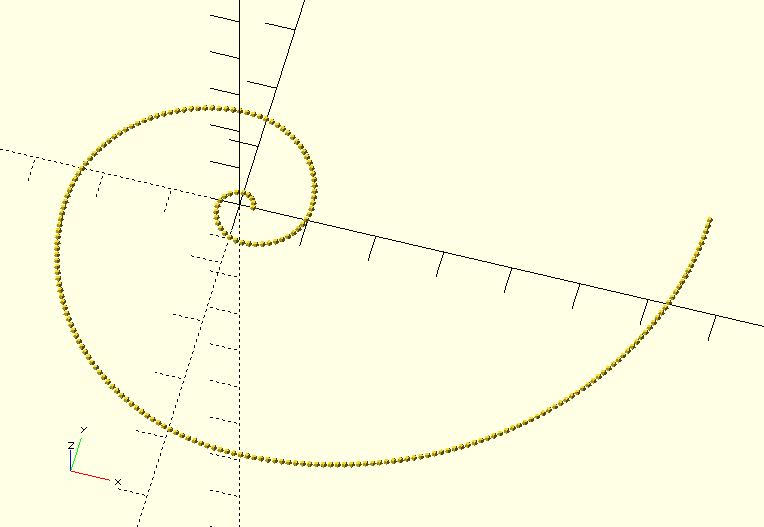
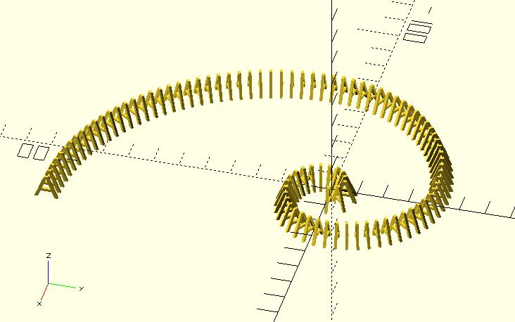

# golden_spiral

Gets all points and angles on the path of a golden spiral. The distance between two  points is almost constant. 

It returns a vector of `[[x, y], angle]`. 

Because of depending on `circle_path` and `rotate_p`, remember to include "circle_path.scad" and "rotate_p.scad".

## Parameters

- `from` : The nth Fibonacci number you wanna start from.
- `to` : The nth Fibonacci number you wanna go to.
- `point_distance` : Distance between two points on the path.
- `rt_dir` : `"CT_CLK"` for counterclockwise. `"CLK"` for clockwise. The default value is `"CT_CLK"`.

## Examples
    
	include <circle_path.scad>;
	include <rotate_p.scad>;
	include <golden_spiral.scad>;
	        
	pts_angles = golden_spiral(
	    from = 3, 
	    to = 10, 
	    point_distance = 1
	);
	
	for(pt_angle = pts_angles) {
	    translate(pt_angle[0]) 
	        sphere(0.5);
    }

	
	include <circle_path.scad>;
	include <rotate_p.scad>;
	include <golden_spiral.scad>;
	        
	pts_angles = golden_spiral(
	    from = 5, 
	    to = 11, 
	    point_distance = 4
	);
	    
	for(pt_angle = pts_angles) {
	    translate(pt_angle[0]) 
	        rotate([90, 0, pt_angle[1]])
	            linear_extrude(1, center = true) 
	                text("A", valign = "center", halign = "center");
	}
    
