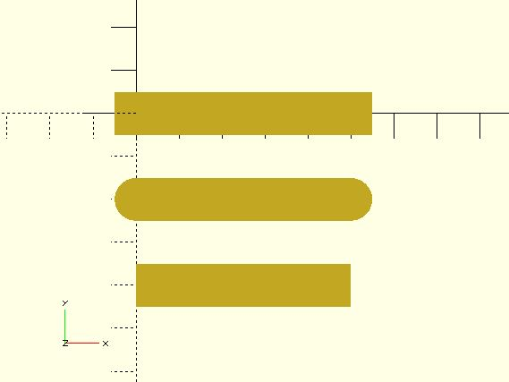

# line2d

Creates a line from two points. 

## Parameters

- `p1` : 2 element vector `[x, y]`.
- `p2` : 2 element vector `[x, y]`.
- `width` : The line width.
- `p1Style` : The end-cap style of the point `p1`. The value must be `"CAP_BUTT"`, `"CAP_SQUARE"` or `"CAP_ROUND"`. The default value is `"CAP_SQUARE"`. 
- `p2Style` : The end-cap style of the point `p2`. The value must be `"CAP_BUTT"`, `"CAP_SQUARE"` or `"CAP_ROUND"`. The default value is `"CAP_SQUARE"`. 
- `round_fn` : When the end-cap style is `"CAP_ROUND"`, it controlls the `$fn` value used by the `circle` module. The default value is `24`.

## Examples

	line2d(p1 = [0, 0], p2 = [5, 0], width = 1);
	
	translate([0, -2, 0]) 
	    line2d(p1 = [0, 0], p2 = [5, 0], width = 1, 
	           p1Style = "CAP_ROUND", p2Style = "CAP_ROUND");
			   
	translate([0, -4, 0]) 
	    line2d(p1 = [0, 0], p2 = [5, 0], width = 1, 
	           p1Style = "CAP_BUTT", p2Style = "CAP_BUTT");

