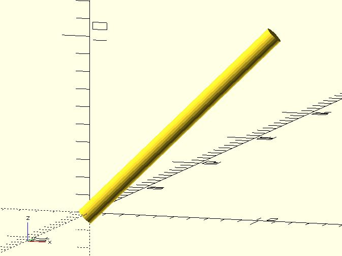
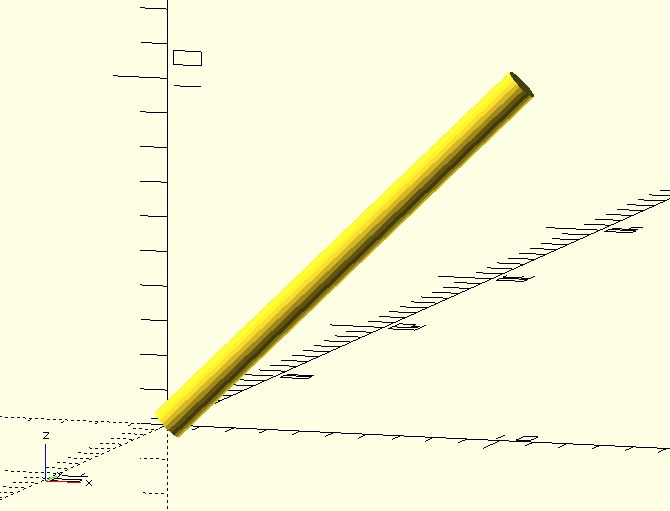
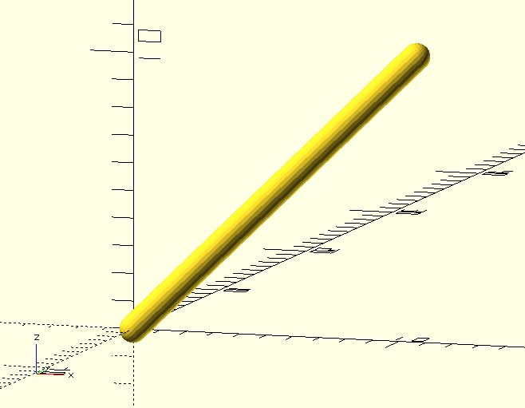

# line3d

Creates a 3D line from two points. 

## Parameters

- `p1` : 3 element vector `[x, y, z]`.
- `p2` : 3 element vector `[x, y, z]`.
- `thickness` : The line thickness.
- `p1Style` : The end-cap style of the point `p1`. The value must be `CAP_BUTT`, `CAP_CIRCLE` or `CAP_SPHERE`. The default value is `CAP_CIRCLE`. 
- `p2Style` : The end-cap style of the point `p2`. The value must be `CAP_BUTT`, `CAP_CIRCLE` or `CAP_ROUND`. The default value is `CAP_CIRCLE`. 
- `fn` : It controlls the `$fn` value used by the `circle` or `sphere` module. The default value is `24`.

## Examples

	line3d(
	    p1 = [0, 0, 0], 
	    p2 = [10, 2, 10], 
	    thickness = 1
	);   

	
	line3d(
	    p1 = [0, 0, 0], 
	    p2 = [10, 2, 10], 
	    thickness = 1, 
	    p1Style = CAP_BUTT, 
	    p2Style = CAP_BUTT
	);   

			   
    line3d(
        p1 = [0, 0, 0], 
        p2 = [10, 2, 10], 
        thickness = 1, 
	    p1Style = CAP_SPHERE, 
	    p2Style = CAP_SPHERE
    );   

