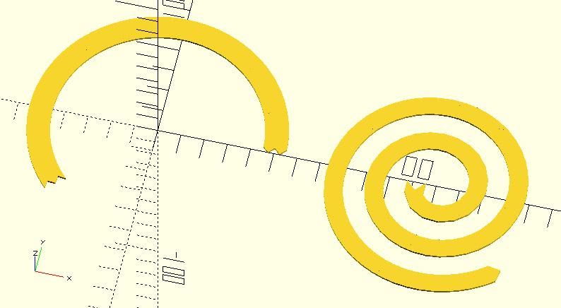

# path_extend

It extends a 2D stroke along a path. This module is suitable for a path created by a continuous function. 

It depends on the rotate_p function and the polytransversals module. Remember to include "rotate_p.scad" and "polytransversals.scad".

When using this module, you should use points to represent the 2D stroke.

## Parameters

- `stroke_pts` : A list of points represent a stroke. See the example below.
- `path_pts` : A list of points represent the path.
- `scale` : Scales the 2D shape by this value over the length of the extrusion.
- `closed` : If the first point and the last point of `path_pts` has the same coordinate, setting `closed` to `true` will connect them automatically.

## Examples

	include <rotate_p.scad>;
	include <polytransversals.scad>;
	include <path_extend.scad>;
	include <circle_path.scad>;
	include <archimedean_spiral.scad>;
	
	$fn = 96;
	
	stroke1 = [[-5, 2.5], [-2.5, 0], [0, 2.5], [2.5, 0], [5, 2.5]];
	path_pts1 = circle_path(50, 60);
	path_extend(stroke1, path_pts1);
	
	stroke2 = [[-4, 0], [0, 4], [4, 0]];
	pts_angles = archimedean_spiral(
	    arm_distance = 17,
	    init_angle = 180,
	    point_distance = 5,
	    num_of_points = 85 
	); 
	
	translate([120, 0, 0]) 
	    path_extend(
	        stroke2, 
	        [for(pa = pts_angles) pa[0]]
	    );

