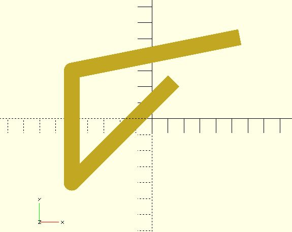
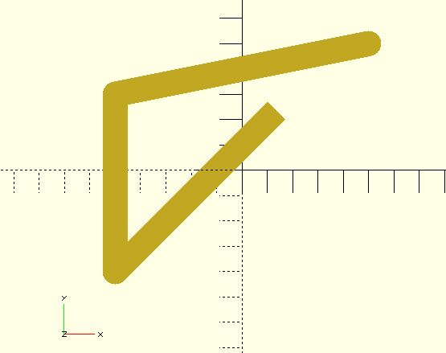

# polyline2d

Creates a polyline from a list of `x`, `y` coordinates. When the end points are `CAP_ROUND`, 
* you can use `$fa`, `$fs` or `$fn` to controll the circle module used internally. It depends on the `line2d` module so you have to `include` line2d.scad.

## Parameters

- `points` : The list of `x`, `y` points of the polyline. : A vector of 2 element vectors. The points are indexed from 0 to n-1.
- `width` : The line width.
- `startingStyle` : The end-cap style of the starting point. The value must be `"CAP_BUTT"`, `"CAP_SQUARE"` or `"CAP_ROUND"`. The default value is `"CAP_SQUARE"`. 
- endingStyle : The end-cap style of the ending point. The value must be `"CAP_BUTT"`, `"CAP_SQUARE"` or `"CAP_ROUND"`. The default value is `"CAP_SQUARE"`. 

## Examples

    $fn = 24;
	polyline2d(points = [[1, 2], [-5, -4], [-5, 3], [5, 5]], width = 1);

    $fn = 24;
    polyline2d(points = [[1, 2], [-5, -4], [-5, 3], [5, 5]], width = 1,
               endingStyle = "CAP_ROUND");

    $fn = 24;
	polyline2d(points = [[1, 2], [-5, -4], [-5, 3], [5, 5]], width = 1,
               startingStyle = "CAP_ROUND", endingStyle = "CAP_ROUND");

