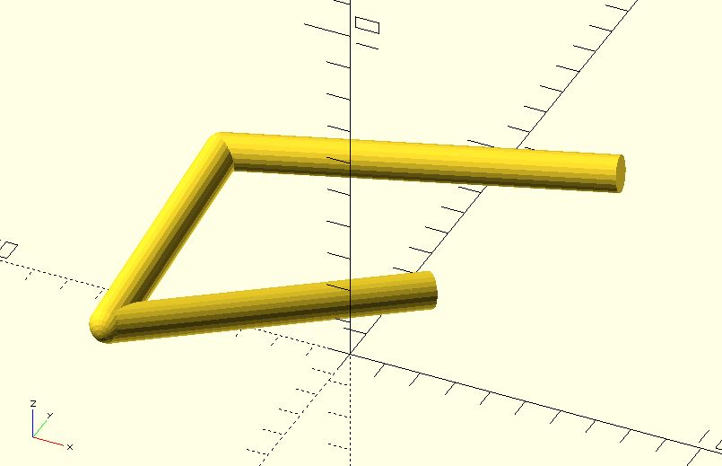
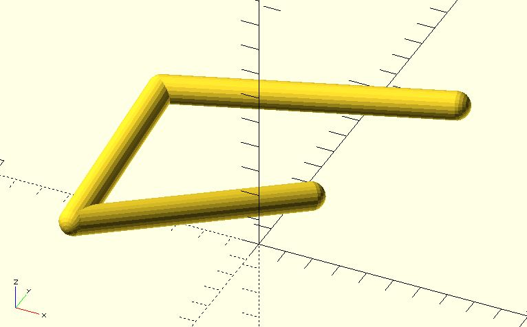
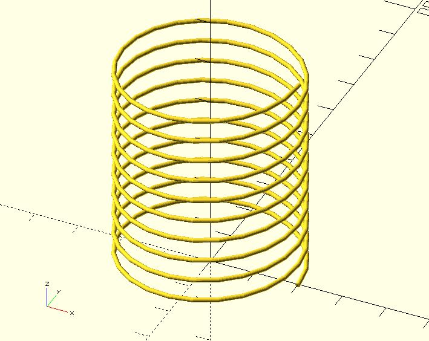

# polyline3d

Creates a polyline from a list of `[x, y, z]` coordinates. It depends on the `line3d` module so you have to `include` line3d.scad.

## Parameters

- `points` : The list of `[x, y, z]` points of the polyline. : A vector of 3 element vectors. The points are indexed from 0 to n-1.
- `thickness` : The line thickness.
- `startingStyle` : The end-cap style of the starting point. The value must be `CAP_BUTT`, `CAP_CIRCLE` or `CAP_SPHERE` (defined in line3d.scad). The default value is `CAP_CIRCLE`. 
- endingStyle : The end-cap style of the ending point. The value must be `CAP_BUTT`, `CAP_CIRCLE` or `CAP_SPHERE` (defined in line3d.scad). The default value is `CAP_CIRCLE`.
- `fn` : It controlls the `$fn` value used by the `circle` and `sphere` module. The default value is `24`.

## Examples

	polyline3d(
	    points = [
	        [1, 2, 1], 
	        [-5, -4, 2], 
	        [-5, 3, 3], 
	        [5, 5, 4]
	    ], 
	    thickness = 1
	);

	polyline3d(
	    points = [
	        [1, 2, 1], 
	        [-5, -4, 2], 
	        [-5, 3, 3], 
	        [5, 5, 4]
	    ], 
	    thickness = 1,
	    endingStyle = CAP_SPHERE
	);

	polyline3d(
	    points = [
	        [1, 2, 1], 
	        [-5, -4, 2], 
	        [-5, 3, 3], 
	        [5, 5, 4]
	    ], 
	    thickness = 1,
	    startingStyle = CAP_SPHERE,
	    endingStyle = CAP_SPHERE
	);

	r = 20;
	h = 5;
	fa = 15;
	circles = 10;
	
	points = [
	    for(a = [0:fa:360 * circles]) 
	        [r * cos(a), r * sin(a), h / (360 / fa) * (a / fa)]
	];
	polyline3d(points, thickness = 1);

