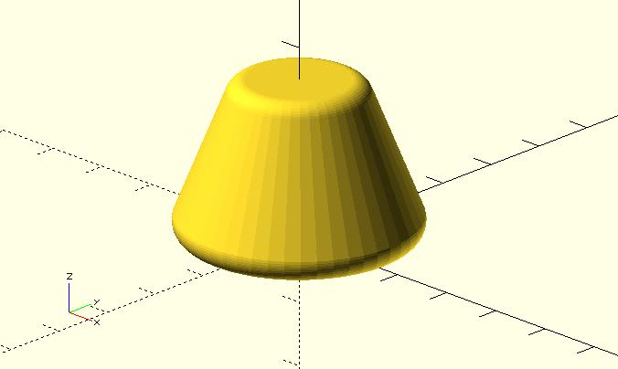

# rounded_cylinder

Creates a rounded cylinder.

## Parameters

- `radius` : The radius of the cylinder. It also accepts a vector `[r1, r2]`. `r1` is the bottom radius and `r2` is the top radius of a cone.
- `h` : The height of the cylinder or cone. 
- `round_r` : The sphere radius which fits the edges of the bottom and the top.
- `center` : `false` (default), z ranges from 0 to h. `true`, z ranges from -h/2 to +h/2
- `convexity` : See [Rotate Extrude](https://en.wikibooks.org/wiki/OpenSCAD_User_Manual/Using_the_2D_Subsystem#Rotate_Extrude) for details.
- `$fa`, `$fs`, `$fn` : Used to control the eight quadrants. Check [the circle module](https://en.wikibooks.org/wiki/OpenSCAD_User_Manual/Using_the_2D_Subsystem#circle) for more details. The final fragments of a sphere will be a multiple of 4 to fit edges.

## Examples

	include <rounded_cylinder.scad>;

	rounded_cylinder(
		radius = [20, 10], 
		h = 25, 
		round_r = 3
	);    

