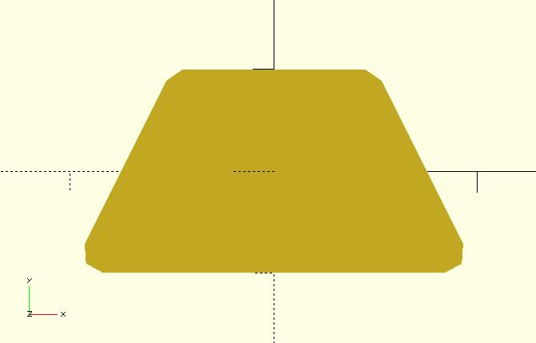
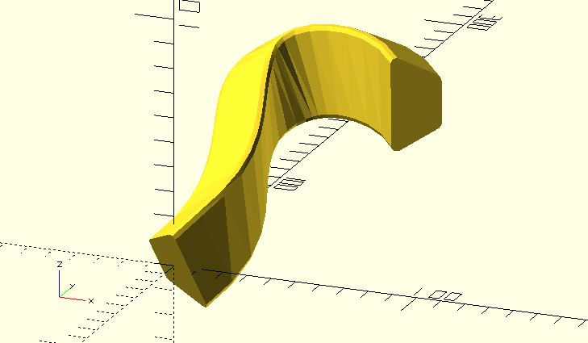

# shape_trapezium

Returns shape points of an isosceles trapezoid. They can be used with xxx_extrude modules of dotSCAD. The shape points can be also used with the built-in polygon module. 

## Parameters

- `length` : The base length of an isosceles trapezium. It also accepts a vector `[a, b]`. `a` is the bottom base and `b` is the top base.
- `h` : The height of the cylinder or cone. 
- `corner_r` : The circle radius which fits the edges of the bottom and the top.
- `$fa`, `$fs`, `$fn` : Used to control the corner fragments. Check [the circle module](https://en.wikibooks.org/wiki/OpenSCAD_User_Manual/Using_the_2D_Subsystem#circle) for more details.

## Examples

	include <shape_trapezium.scad>;

	polygon(
		shape_trapezium([40, 20], 
		h = 20,
		corner_r = 2)
	);

	include <shape_trapezium.scad>;
	include <rotate_p.scad>;
	include <polysections.scad>;
	include <path_extrude.scad>;
	include <bezier_curve.scad>;

	t_step = 0.05;
	width = 2;

	shape_pts = shape_trapezium(
		[40, 20], 
		h = 20, 
		corner_r = 2
	);

	p0 = [0, 0, 0];
	p1 = [40, 60, 35];
	p2 = [-50, 70, 45];
	p3 = [20, 150, 55];
	p4 = [80, 50, 60];

	path_pts = bezier_curve(t_step, 
		[p0, p1, p2, p3, p4]
	);

	path_extrude(shape_pts, path_pts);   

	