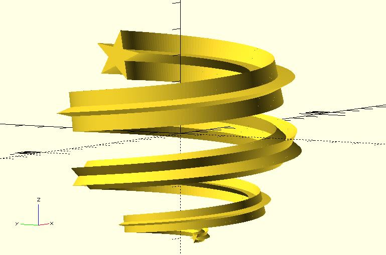

# sphere_spiral_extrude

Extrudes a 2D shape along the path of a sphere spiral. 

When using this module, you should use points to represent the 2D shape. If your 2D shape is not solid, indexes of triangles are required. See [polysections](https://openhome.cc/eGossip/OpenSCAD/lib-polysections.html) for details.

## Parameters

- `shape_pts` : A list of points represent a shape. See the example below.
- `radius` , `za_step`, `z_circles`, `begin_angle`, `end_angle`, `vt_dir`, `rt_dir` : See [sphere_spiral](https://openhome.cc/eGossip/OpenSCAD/lib-sphere_spiral.html) for details.
- `twist` : The number of degrees of through which the shape is extruded.
- `scale` : Scales the 2D shape by this value over the length of the extrusion. Scale can be a scalar or a vector.
- `triangles` : `"SOLID"` (default), `"HOLLOW"` or user-defined indexes. See [polysections](https://openhome.cc/eGossip/OpenSCAD/lib-polysections.html) for details.

## Examples
    
	include <rotate_p.scad>;
	include <cross_sections.scad>;
	include <polysections.scad>;
	include <sphere_spiral.scad>;
	include <sphere_spiral_extrude.scad>;

	function shape_pentagram(r) = 
        [
            [0, 1], [-0.224514, 0.309017], 
            [-0.951057, 0.309017], [-0.363271, -0.118034], 
            [-0.587785, -0.809017], [0, -0.381966], 
            [0.587785, -0.809017], [0.363271, -0.118034], 
            [0.951057, 0.309017], [0.224514, 0.309017]
        ] * r;

	points_triangles = shape_pentagram(2);

	sphere_spiral_extrude(
		shape_pts = points_triangles,
		radius = 40, 
		za_step = 2, 
		z_circles = 20, 
		begin_angle = 90, 
		end_angle = 450,
		vt_dir = "SPI_UP",
		scale = 5
	);

