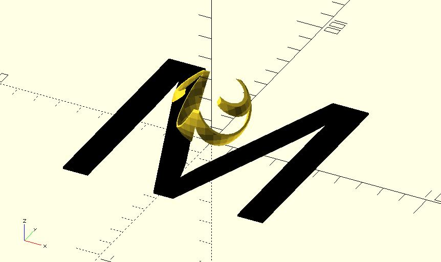

# stereographic_extrude

Takes a 2D polygon as input and extends it onto a sphere. If you light up a lamp on the north pole of the sphere, the shadow will return to the original 2D polygon. For more information, take a look at [Stereographic projection](https://en.wikipedia.org/wiki/Stereographic_projection).

The 2D polygon should center at the origin and you have to determine the side length of a square which can cover the 2D polygon. Because the 2D polygon will be extended onto a sphere, you can use `$fa`, `$fs` or `$fn` to controll the sphere resolution.

## Parameters

- `shadow_side_leng` : The side length of a square which can cover the 2D polygon.
- `$fa`, `$fs`, `$fn` : Check [the sphere module](https://en.wikibooks.org/wiki/OpenSCAD_User_Manual/Primitive_Solids#sphere for more details.

## Examples
    
    include <stereographic_extrude.scad>;
    
	dimension = 100;
	
	render() stereographic_extrude(shadow_side_leng = dimension)
	   text(
            "M", size = dimension, 
            valign = "center", halign = "center"
       );
	   
	color("black") 
	   text(
            "M", size = dimension, 
            valign = "center", halign = "center"
       );

For more advanced examples, take a look at [my stereographic_projection collection](https://www.thingiverse.com/JustinSDK/collections/stereographic-projection).