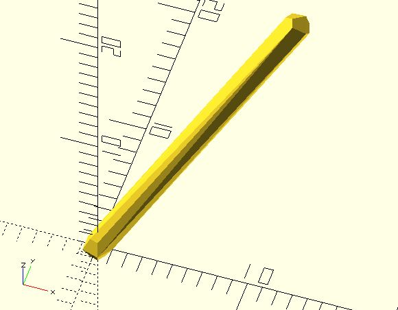
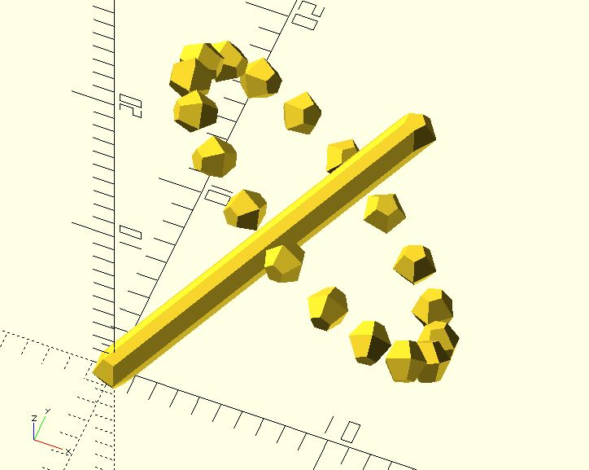

# m_rotation

Generate a 4x4 transformation matrix which can pass into `multmatrix` to rotate the child element about the axis of the coordinate system or around an arbitrary axis. 

**Since:** 1.1

## Parameters

- `a` : If it's `[deg_x, deg_y, deg_z]`, the rotation is applied in the order `x`, `y`, `z`. If it's `[deg_x, deg_y]`, the rotation is applied in the order `x`, `y`.  If it's`[deg_x]`, the rotation is only applied to the `x` axis. If it's an number, the rotation is only applied to the `z` axis or an arbitrary axis.
- `v`: A vector allows you to set an arbitrary axis about which the object will be rotated. When `a` is an array, the `v` argument is ignored. 

## Examples

	include <matrix/m_rotation.scad>;

	point = [20, 0, 0];
	a = [0, -45, 45];

	hull() {
		sphere(1);
		multmatrix(m_rotation(a))    
			translate(point) 
				sphere(1);   
	}  

	include <m_rotation.scad>;

	v = [10, 10, 10];

	hull() {
		sphere(1);
		translate(v)
		sphere(1);   
	}

	p = [10, 10, 0];
	for(i = [0:20:340]) {
		multmatrix(m_rotation(a = i, v = v))
			translate(p) 
				sphere(1);  
	}

