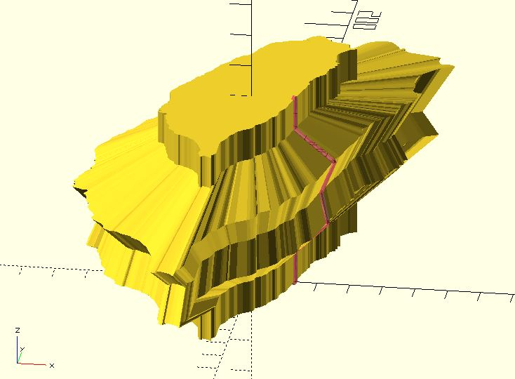
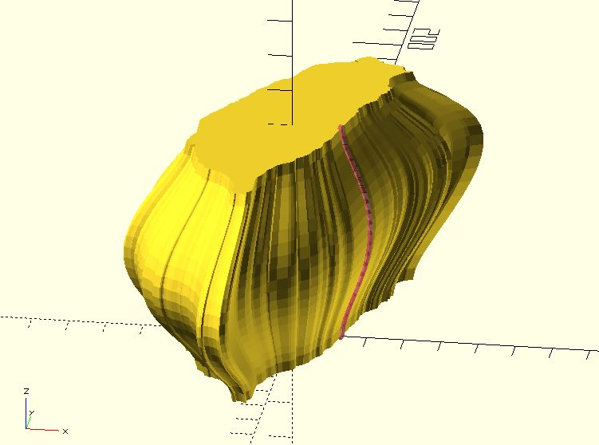
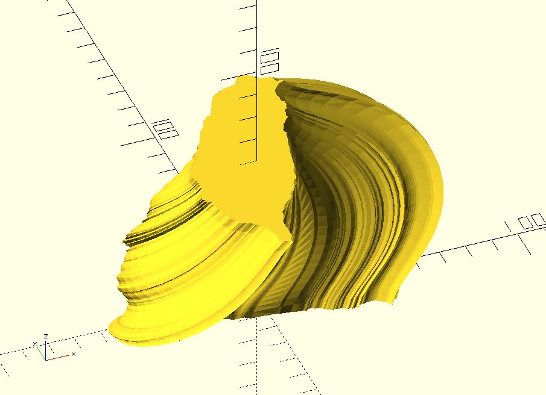
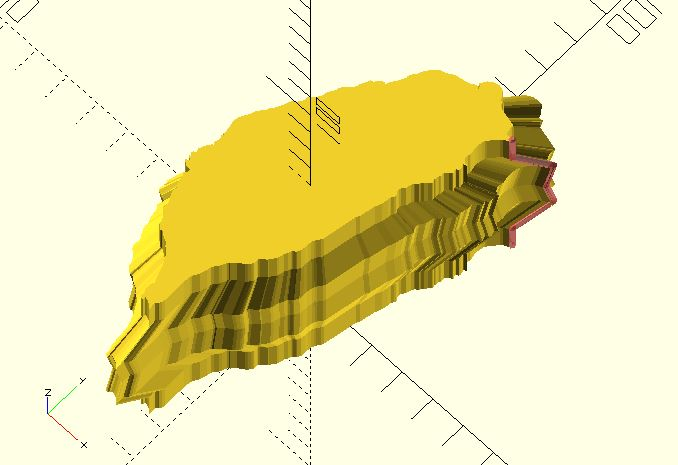

# path_scaling_sections

Given an edge path with the first point at the outline of a shape. This function uses the path to calculate scaling factors and returns all scaled sections in the reversed order of the edge path. Combined with the `polysections` module, you can create an extrusion with the path as an edge. 

In order to control scaling factors easily, I suggest using `[x, 0, 0]` as the first point and keeping y = 0 while building the edge path.

You can use any point as the first point of the edge path. Just remember that your edge path radiates from the origin.

**Since:** 1.2.

## Parameters

- `shape_pts` : A list of points represent a shape.
- `edge_path` : A list of points represent the edge path.

## Examples

	include <hull_polyline3d.scad>;
	include <shape_taiwan.scad>;
	include <path_scaling_sections.scad>;
	include <polysections.scad>;

	taiwan = shape_taiwan(100);
	fst_pt = [13, 0, 0];

	edge_path = [
		fst_pt,
		fst_pt + [0, 0, 10],
		fst_pt + [10, 0, 20],
		fst_pt + [8, 0, 30],
		fst_pt + [12, 0, 40],
		fst_pt + [0, 0, 50],
		fst_pt + [0, 0, 60]
	];

	#hull_polyline3d(edge_path);
	polysections(path_scaling_sections(taiwan, edge_path));

	include <hull_polyline3d.scad>;
	include <shape_taiwan.scad>;
	include <path_scaling_sections.scad>;
	include <polysections.scad>;
	include <bezier_curve.scad>;

	taiwan = shape_taiwan(100);
	fst_pt = [13, 0, 0];

	edge_path = bezier_curve(0.05, [
		fst_pt,
		fst_pt + [0, 0, 10],
		fst_pt + [10, 0, 20],
		fst_pt + [8, 0, 30],
		fst_pt + [12, 0, 40],
		fst_pt + [0, 0, 50],
		fst_pt + [0, 0, 60]
	]);

	#hull_polyline3d(edge_path);
	polysections(path_scaling_sections(taiwan, edge_path));

	include <shape_taiwan.scad>;
	include <path_scaling_sections.scad>;
	include <polysections.scad>;
	include <bezier_curve.scad>;
	include <rotate_p.scad>;

	taiwan = shape_taiwan(100);
	fst_pt = [13, 0, 0];

	edge_path = bezier_curve(0.05, [
		fst_pt,
		fst_pt + [0, 0, 10],
		fst_pt + [10, 0, 20],
		fst_pt + [8, 0, 30],
		fst_pt + [12, 0, 40],
		fst_pt + [0, 0, 50],
		fst_pt + [0, 0, 60]
	]);

	leng = len(edge_path);
	twist = -90;
	twist_step = twist / leng;
	sections = path_scaling_sections(taiwan, edge_path);

	rotated_sections = [
		for(i = [0:leng - 1]) 
		[
			for(p = sections[i]) 
				rotate_p(p, twist_step * i)        
		]
	];

	polysections(rotated_sections);

	

	include <hull_polyline3d.scad>;
	include <shape_taiwan.scad>;
	include <path_scaling_sections.scad>;
	include <polysections.scad>;
    include <rotate_p.scad>;

	taiwan = shape_taiwan(100);

    /* 
	    You can use any point as the first point of the edge path.
		Just remember that your edge path radiates from the origin.
	*/
	fst_pt = [taiwan[0][0], taiwan[0][1], 0];//[13, 0, 0];
    a = atan2(fst_pt[1], fst_pt[0]);
	edge_path = [
		fst_pt,
		fst_pt + rotate_p([0, 0, 10], a),
		fst_pt + rotate_p([10, 0, 20], a),
		fst_pt + rotate_p([8, 0, 30], a),
		fst_pt + rotate_p([10, 0, 40], a),
		fst_pt + rotate_p([0, 0, 50], a),
		fst_pt + rotate_p([0, 0, 60], a)
	];

	#hull_polyline3d(edge_path);
	polysections(path_scaling_sections(taiwan, edge_path));

