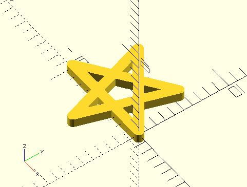
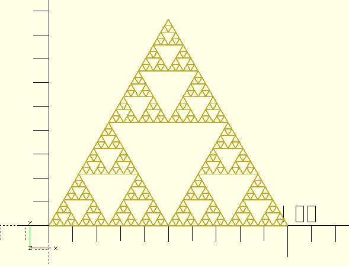

# t2d

An implementation of Turtle Graphics with Fluent API. It moves on the xy plane. You can get the cooridinate `[x, y]` or `angle` of its current position. 

**Since: 2.1**

## Parameters

- `t` : The data of a turtle. `t2d()` with no arguments will return a turtle with the point `[0, 0]` and the angle `0`.
- `cmd` : It accepts a string or a list of commands. 
    - Given a string: `"turn"`, `"forward"`, `"point"` or `"angle"`. If `"turn"` is provided, the `angle` parameter is required. If `"forward"` is provided, `leng` is required. `"point"` and `"angle"` are used to get respective data from a turtle.
    - Given a list: `[[cmd1, value], [cmd2, value2], ...]`. For example, `[["forward", 10], ["turn", 120]]` will forward a turtle 10mm and turn it 120 degrees. 
- `point` : Set the position of a turtle. 
- `angle` : Set the angle of a turtle if `cmd` is not provided. Turn a turtle if `cmd` is `"turn"`. 
- `leng` : Forward a turtle if `cmd` is `"forward"`.

## Examples
	    
	include <line2d.scad>;
	include <turtle/t2d.scad>;
	
	module turtle_spiral(t, times, side_leng, angle, width) {
	    $fn = 24;
	    if(times != 0) {
	        t1 = t2d(t, "turn", angle = angle);
	        t2 = t2d(t1, "forward", leng = side_leng);
	
	        line2d(
	            t2d(t, "point"),
	            t2d(t2, "point"),
	            width,
	            p1Style = "CAP_ROUND", 
	            p2Style =  "CAP_ROUND"
	        );
	
	        turtle_spiral(t2, times - 1, side_leng, angle, width);
	    }
	
	}
	
	turtle_spiral(
	    t2d(point = [0, 0], angle = 0), 
	    times = 5, 
	    side_leng = 10, 
	    angle = 144, 
	    width = 1
	);

The code below creates the same drawing.

	include <line2d.scad>;
	include <turtle/t2d.scad>;

	module turtle_spiral(t, times, side_leng, angle, width) {
		$fn = 24;
		if(times != 0) {
			t1 = t2d(t, [
				["turn", angle],
				["forward", side_leng]
			]);
			
			line2d(
				t2d(t, "point"),
				t2d(t1, "point"),
				width,
				p1Style = "CAP_ROUND", 
				p2Style =  "CAP_ROUND"
			);

			turtle_spiral(t1, times - 1, side_leng, angle, width);
		}
	}

	turtle_spiral(
		t2d(point = [0, 0], angle = 0), 
		times = 5, 
		side_leng = 10, 
		angle = 144, 
		width = 1
	);	 

	
	include <hull_polyline2d.scad>;
	include <turtle/t2d.scad>;
	
	side_leng = 100;
	min_leng = 4;
	thickness = 0.5; 
	
	sierpinski_triangle(
	    t2d(point = [0, 0], angle = 0),
	    side_leng, min_leng, thickness, $fn = 3
	);
	
	module triangle(t, side_leng, thickness) {    
	    t2 = t2d(t, "forward", leng = side_leng);
	    t3 = t2d(t2, [
	        ["turn", 120],
	        ["forward", side_leng]
	    ]);
	
	    hull_polyline2d(
	        [for(turtle = [t, t2, t3, t]) t2d(turtle, "point")], 
	        thickness
	    );
	}
	
	module sierpinski_triangle(t, side_leng, min_leng, thickness) {
	    triangle(t, side_leng, thickness);
	
	    if(side_leng >= min_leng) { 
	        half_leng = side_leng / 2;
	        t2 = t2d(t, "forward", leng = half_leng); 
	        t3 = t2d(t, [
	            ["turn", 60],
	            ["forward", half_leng],
	            ["turn", -60]
	        ]);

	        for(turtle = [t, t2, t3]) {
	            sierpinski_triangle(turtle, half_leng, min_leng, thickness);
	        }
	    }
	}

