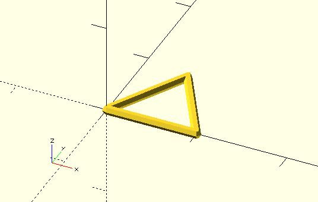
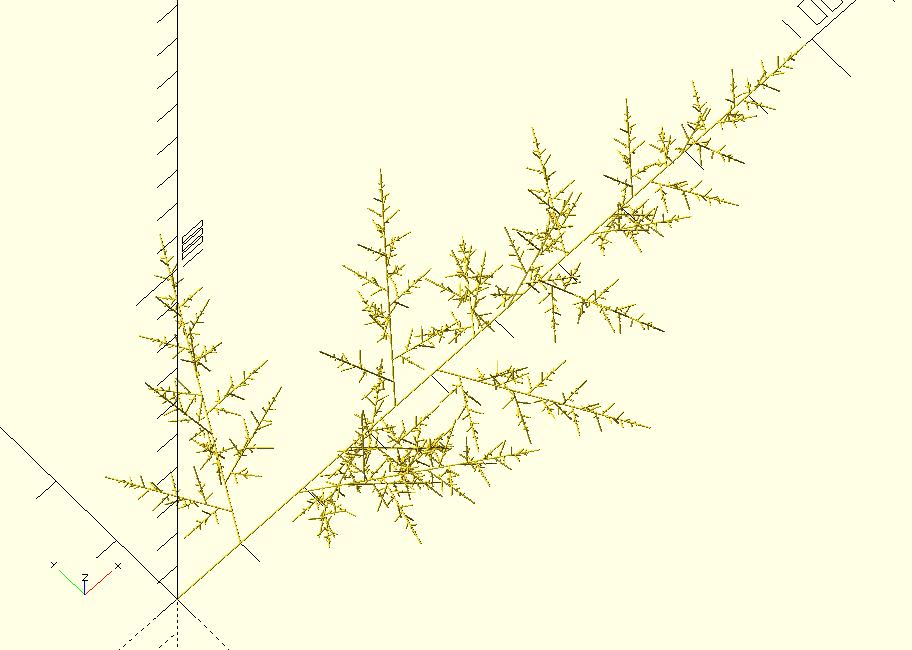

# turtle3d

An OpenSCAD implementation of 3D Turtle Graphics. When using the function, imagine that you are sitting on the turtle. You move or turn the turtle from the your viewpoint, not the viewpoint of OpenSCAD coordinates.

For more details, please see [3D turtle graphics](https://openhome.cc/eGossip/OpenSCAD/3DTurtleGraphics.html). 

## Parameters

- `cmd` : A string command. Different commands use different numbers of arguments. 
    - `"create"` : Creates a turtle data. The simplest way is `turtle3d("create")` which creates a turtle located at `[0, 0, 0]` (and unit vectors `[[1, 0, 0], [0, 1, 0], [0, 0, 1]]`). You can pass your own starting point and unit vectors, such as `turtle3d("create", [0, 0, 0], [[1, 0, 0], [0, 1, 0], [0, 0, 1]])`.
    - `"xu_move"`, `"yu_move"`, `"zu_move"` : These commands need two arguments, the turtle data and the length you want to move from your viewpoint (you sit on the turtle). For example, `"turtle3d("xu_move", turtle, 10)"`.
    - `"xu_turn"`, `"yu_turn"`, `"zu_turn"` : These commands need two arguments, the turtle data and the angle you want to turn from your viewpoint (you sit on the turtle). For example, `"turtle3d("xu_turn", turtle, 45)"`.
    - `"pt"` : Gets the point of the turtle. It requires one argument, the turtle data. For example, `"turtle3d("pt", turtle)"`.
    - `"unit_vts"` : Gets the unit vectors of the turtle. It requires one argument, the turtle data. For example, `"turtle3d("unit_vts", turtle)"`.

## Examples
	    
	include <turtle/turtle3d.scad>;
	include <hull_polyline3d.scad>;
	
	leng = 10;
	angle = 120;
	thickness = 1;
	
	t = turtle3d("create");
	
	t2 = turtle3d("xu_move", t, leng);
	hull_polyline3d(
	    [turtle3d("pt", t), turtle3d("pt", t2)], 
	    thickness
	);
	
	t3 = turtle3d("xu_move", turtle3d("zu_turn", t2, angle), leng);
	hull_polyline3d(
	    [turtle3d("pt", t2), turtle3d("pt", t3)], 
	    thickness
	);
	
	t4 = turtle3d("xu_move", turtle3d("zu_turn", t3, angle), leng);
	hull_polyline3d(
	    [turtle3d("pt", t3), turtle3d("pt", t4)], 
	    thickness
	);

	
	include <turtle/turtle3d.scad>;
	include <hull_polyline3d.scad>;
	
	module tree(t, leng, leng_scale1, leng_scale2, leng_limit, 
	            angleZ, angleX, width) {
	    if(leng > leng_limit) {
	        t2 = turtle3d("xu_move", t, leng);
	        
	        hull_polyline3d(
	            [turtle3d("pt", t), turtle3d("pt", t2)], 
	            width);
	
	        tree(
	            turtle3d("zu_turn", t2, angleZ),
	            leng * leng_scale1, leng_scale1, leng_scale2, leng_limit, 
	            angleZ, angleX, 
	            width);
	
	        tree(
	            turtle3d("xu_turn", t2, angleX), 
	            leng * leng_scale2, leng_scale1, leng_scale2, leng_limit, 
	            angleZ, angleX, 
	            width);
	    }    
	}
	
	leng = 100;
	leng_limit = 1;
	leng_scale1 = 0.4;
	leng_scale2 = 0.9;
	angleZ = 60;
	angleX = 135;
	width = 2;
	
	t = turtle3d("create");
	
	tree(t, leng, leng_scale1, leng_scale2, leng_limit, 
	     angleZ, angleX, width);

