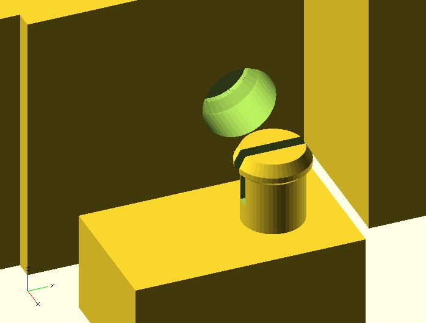
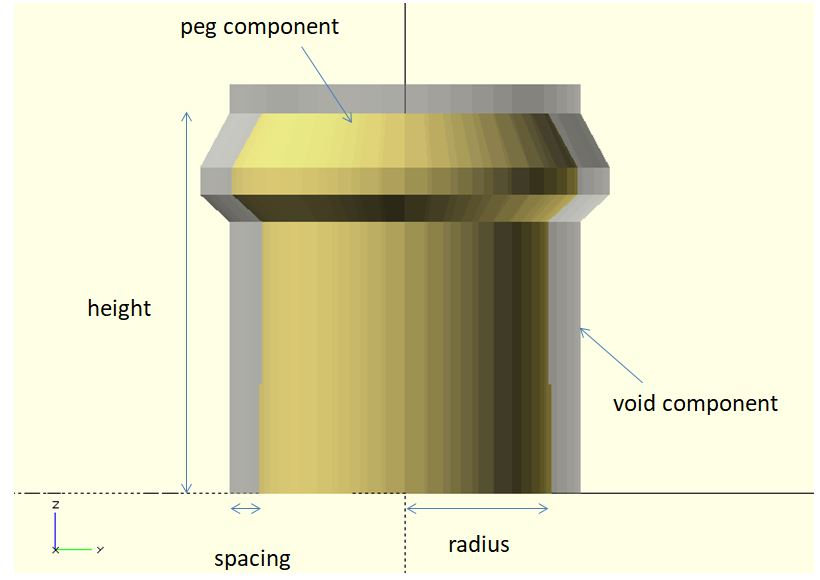
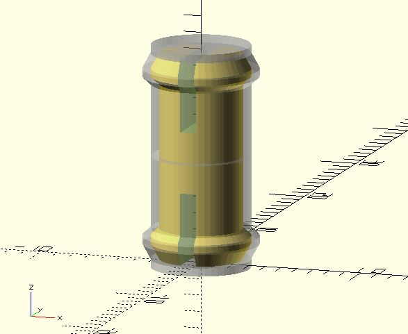

# connector_peg

Create a connector peg.

**Since:** 2.1

## Parameters

- `radius` : The shaft radius of the peg.
- `height` : The height of the pag. Default to `2.5 * radius`.
- `spacing` : The spacing between the peg and void component. Default to `0.5`.
- `void` : The void component for differencing. It's used to create a cavity for a peg. Default to `false`.
- `ends` : Default to `false`. To create a double-ended peg, set it to `true`.

## Examples

	use <part/connector_peg.scad>;

	radius = 2.5;
	spacing = 0.5;

	$fn = 48;

	connector_peg(
		radius = radius, 
		spacing = spacing
	);

	%connector_peg(
		radius = radius, 
		spacing = spacing,
		void = true
	);

	use <part/connector_peg.scad>;

	radius = 2.5;
	spacing = 0.5;

	$fn = 48;

	connector_peg(
		radius = radius, 
		spacing = spacing,
		ends = true
	);

	%connector_peg(
		radius = radius, 
		spacing = spacing,
		ends = true,
		void = true
	);

