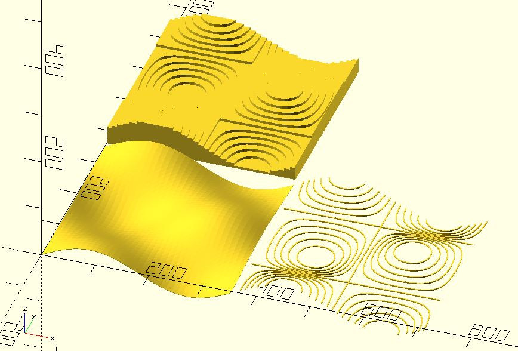

# contours

Computes contour polygons by applying [marching squares](https://en.wikipedia.org/wiki/Marching_squares) to a rectangular list of numeric values. 

**Since:** 2.3

## Parameters

- `points` : 2 value array `[x, y]`, rectangle with dimensions `x` and `y`.
- `threshold` : When applying a threshold value, the function returns isolines. When applying upper and lower threshold values, it returns isobands.

## Examples

    use <hull_polyline2d.scad>;
    use <function_grapher.scad>;
    use <contours.scad>;

    min_value =  1;
    max_value = 360;
    resolution = 10;

    function f(x, y) = sin(x) * cos(y) * 30;
    
    points = [
        for(y = [min_value:resolution:max_value])
            [
                for(x = [min_value:resolution:max_value]) 
                    [x, y, f(x, y)]
            ]
    ];

    function_grapher(points, 1);

    translate([max_value, 0, 0]) 
    for(z = [-30:5:30]) {
        translate([0, 0, z])
        linear_extrude(1)
        for(isoline = contours(points, z)) {
            hull_polyline2d(isoline, width = 1);
        }    
    }

    translate([0, max_value]) 
    for(z = [-30:5:30]) {
        linear_extrude(35 + z)
        for(isoband = contours(points, [z, z + 5])) {
            polygon([for(p = isoband) [p[0], p[1]]]);
        } 
    }

