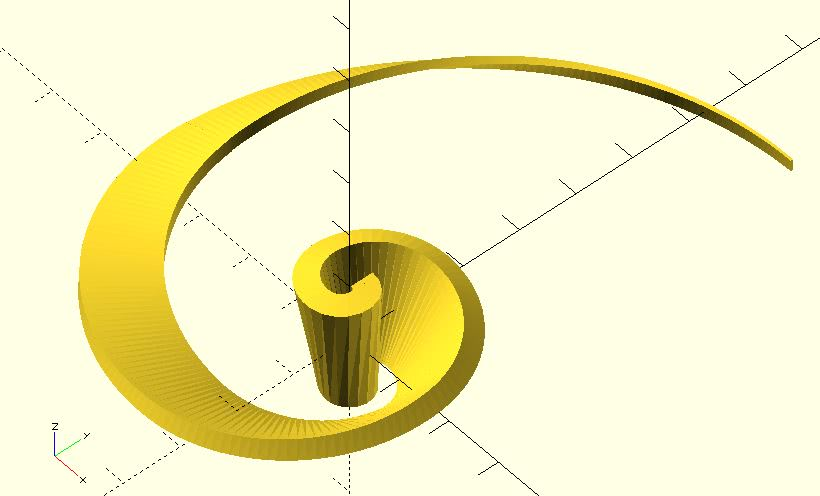
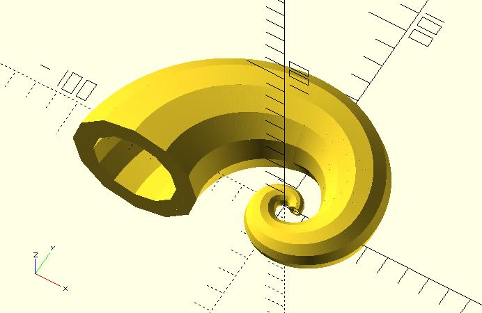

# golden_spiral_extrude

Extrudes a 2D shape along the path of a golden spiral. 

When using this module, you should use points to represent the 2D shape. If your 2D shape is not solid, indexes of triangles are required. See [polysections](https://openhome.cc/eGossip/OpenSCAD/lib2x-polysections.html) for details.

## Parameters

- `shape_pts` : A list of points represent a shape. See the example below.
- `from` : The nth Fibonacci number you wanna start from.
- `to` : The nth Fibonacci number you wanna go to.
- `point_distance` : Distance between two points on the path.
- `rt_dir` : `"CT_CLK"` for counterclockwise. `"CLK"` for clockwise. The default value is `"CT_CLK"`.
- `twist` : The number of degrees of through which the shape is extruded.
- `scale` : Scales the 2D shape by this value over the length of the extrusion. Scale can be a scalar or a vector.
- `triangles` : `"SOLID"` (default), `"HOLLOW"` or user-defined indexes. See [polysections](https://openhome.cc/eGossip/OpenSCAD/lib2x-polysections.html) for details.

## Examples
    
	use <golden_spiral_extrude.scad>;

	shape_pts = [
		[2, -10],
		[2, 10],
		[-2, 10],
		[-2, -10]
	];

	golden_spiral_extrude(
		shape_pts, 
		from = 3, 
		to = 10, 
		point_distance = 1,
		rt_dir = "CLK",
		twist = 180,
		scale = 0.1
	);

    use <shape_circle.scad>;
	use <golden_spiral_extrude.scad>;

	$fn = 12;

	shape_pts = concat(
		shape_circle(radius = 3),
		shape_circle(radius = 2)
	);

	golden_spiral_extrude(
		shape_pts, 
		from = 5, 
		to = 10, 
		point_distance = 1,
		scale = 10,
		triangles = "HOLLOW"
	);

