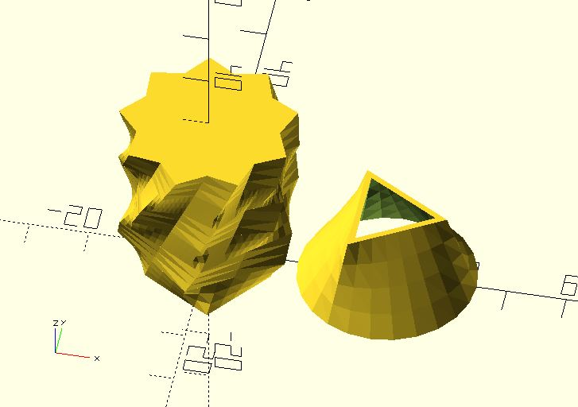

# loft

When having uniform cross sections, you can use [sweep](https://openhome.cc/eGossip/OpenSCAD/lib2x-sweep.html) to create a model. The `loft` here is best when you have a body with multiple crosssections with different geometries. 

**Since:** 2.3

## Parameters

- `sections` : A list of cross-sections, The points must be count-clockwise indexes.
- `slices` : Defines the number of intermediate points between two sections. Default to 1.

## Examples

	use <shape_starburst.scad>;
	use <shape_circle.scad>;
	use <ptf/ptf_rotate.scad>;
	use <loft.scad>;
		
	sects = [
		for(i = 10; i >= 4; i = i - 1)
		[
			for(p = shape_starburst(15, 12, i % 2 == 1 ? i : i - 1)) ptf_rotate([p[0], p[1], 5 * (i - 4)], i * 10)
		]
	];
	loft(sects, slices = 3);

	translate([30, 0, 0])
	difference() {
		loft(
			[
				[for(p = shape_circle(10, $fn = 3)) [p[0], p[1], 15]],
				[for(p = shape_circle(15, $fn = 24)) [p[0], p[1], 0]]        
			],
			slices = 4
		);

		loft(
			[
				[for(p = shape_circle(8, $fn = 3)) [p[0], p[1], 15.1]],
				[for(p = shape_circle(13, $fn = 24)) [p[0], p[1], -0.1]]        
			],
			slices = 4
		);    
	}

