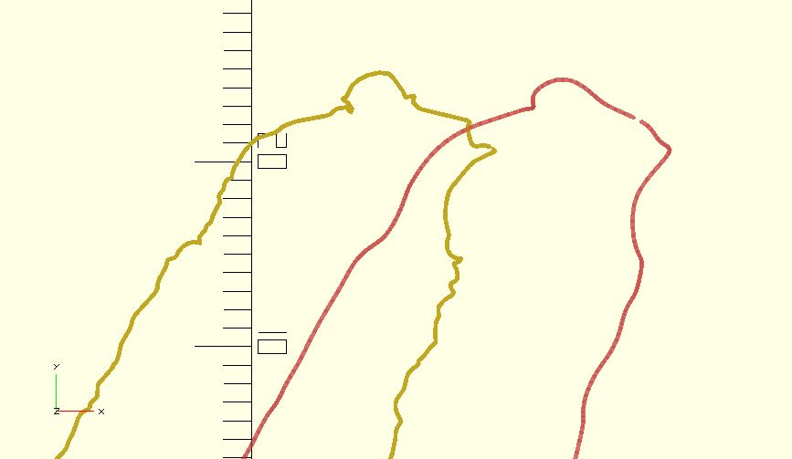

# midpt_smooth

Given a 2D path, this function constructs a mid-point smoothed version by joining the mid-points of the lines of the path. 

**Since:** 1.3

## Parameters

- `points` : The path points.
- `n` : Perform mid-point smoothing n times.
- `closed` : Is the points a 2D shape? If it's `true`, the function takes the last point and the first one to calculate a middle point. Default to `false`.

## Examples

    use <hull_polyline2d.scad>;
    use <shape_taiwan.scad>;
    use <midpt_smooth.scad>;

    taiwan = shape_taiwan(50);  
    smoothed = midpt_smooth(taiwan, 20, true);

    translate([0, 0, 0]) hull_polyline2d(taiwan, .25); 
    #translate([10, 0, 0]) hull_polyline2d(smoothed, .25);

