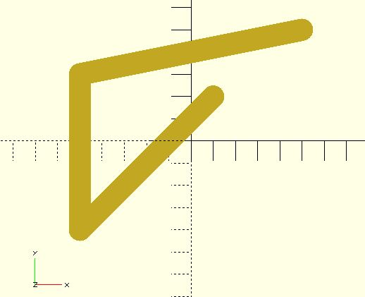

# polyline2d

Creates a polyline from a list of `x`, `y` coordinates. When the end points are `CAP_ROUND`, you can use `$fa`, `$fs` or `$fn` to controll the circle module used internally.

## Parameters

- `points` : The list of `[x, y]` points of the polyline. The points are indexed from 0 to n-1.
- `width` : The line width.
- `startingStyle` : The end-cap style of the starting point. The value must be `"CAP_BUTT"`, `"CAP_SQUARE"` or `"CAP_ROUND"`. The default value is `"CAP_SQUARE"`. 
- `endingStyle` : The end-cap style of the ending point. The value must be `"CAP_BUTT"`, `"CAP_SQUARE"` or `"CAP_ROUND"`. The default value is `"CAP_SQUARE"`. 
- `joinStyle`: Applies to the vertex where two lines join. The value must be `"JOIN_ROUND"`, `"JOIN_MITER"` or `"JOIN_BEVEL"`. The default value is `"JOIN_ROUND"`. Since 2.4.
- `$fa`, `$fs`, `$fn` : Check [the circle module](https://en.wikibooks.org/wiki/OpenSCAD_User_Manual/Using_the_2D_Subsystem#circle) for more details. The final fragments of a circle will be a multiple of 4 to fit edges if possible.

## Examples

    use <polyline2d.scad>;

    $fn = 24;
	polyline2d(points = [[1, 2], [-5, -4], [-5, 3], [5, 5]], width = 1);

    use <polyline2d.scad>;
    
    $fn = 24;
    polyline2d(points = [[1, 2], [-5, -4], [-5, 3], [5, 5]], width = 1,
               endingStyle = "CAP_ROUND");

    use <polyline2d.scad>;
    
    $fn = 24;
	polyline2d(points = [[1, 2], [-5, -4], [-5, 3], [5, 5]], width = 1,
               startingStyle = "CAP_ROUND", endingStyle = "CAP_ROUND");

