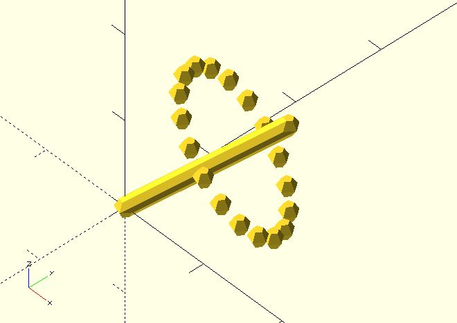

# ptf_rotate

Rotates a point `a` degrees around the axis of the coordinate system or an arbitrary axis. It behaves as the built-in `rotate` module

**Since:** 2.3

## Parameters

- `point` : A 3D point `[x, y, z]` or a 2D point `[x, y]`.
- `a` : If it's `[deg_x, deg_y, deg_z]`, the rotation is applied in the order `x`, `y`, `z`. If it's `[deg_x, deg_y]`, the rotation is applied in the order `x`, `y`.  If it's`[deg_x]`, the rotation is only applied to the `x` axis. If it's an number, the rotation is only applied to the `z` axis or an arbitrary axis.
- `v`: A vector allows you to set an arbitrary axis about which the object will be rotated. When `a` is an array, the `v` argument is ignored. 

**Since:** 2.3.

## Examples

    use <ptf/ptf_rotate.scad>;

	point = [20, 0, 0];
	a = [0, -45, 45];
	
	hull() {
	    sphere(1);
	    translate(ptf_rotate(point, a))    
	       rotate(a)  
	           sphere(1);   
	}  

    use <ptf/ptf_rotate.scad>;

	radius = 40;
	step_angle = 10;
	z_circles = 20;
	
	points = [for(a = [0:step_angle:90 * z_circles]) 
	    ptf_rotate(
	        [radius, 0, 0], 
	        [0, -90 + 2 * a / z_circles, a]
	    )
	];
	
	for(p = points) {
	    translate(p) 
	        sphere(1);
	}
	
	%sphere(radius);

	use <ptf/ptf_rotate.scad>;

	v = [10, 10, 10];

	hull() {
		sphere(1);
		translate(v)
		sphere(1);   
	}

	p = [10, 10, 0];
	for(i = [0:20:340]) {
		translate(ptf_rotate(p, a = i, v = v)) 
			sphere(1);  
	}
	
