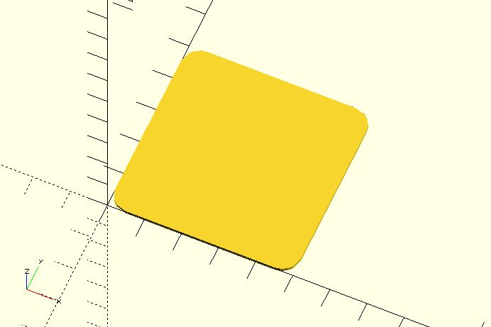
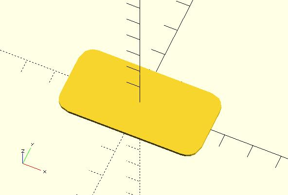
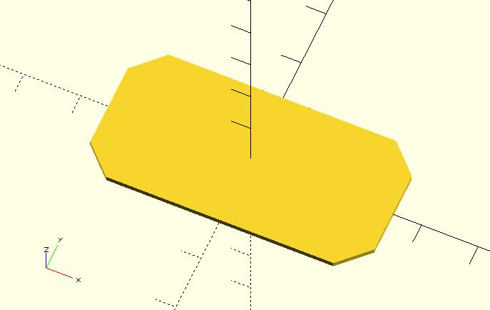

# rounded_square

Creates a rounded square or rectangle in the first quadrant. When `center` is `true` the square is centered on the origin.

## Parameters

- `size` : Accepts single value, square with both sides this length. It also accepts 2 value array `[x, y]`, rectangle with dimensions `x` and `y`.
- `corner_r` : The corner is one-quarter of a circle (quadrant). The `corner_r` parameter determines the circle radius.
- `center` : `false` (default), 1st (positive) quadrant, one corner at (0,0). `true`, square is centered at (0,0).
- `$fa`, `$fs`, `$fn` : Used to control the four quadrants. Check [the circle module](https://en.wikibooks.org/wiki/OpenSCAD_User_Manual/Using_the_2D_Subsystem#circle) for more details.

## Examples

    use <rounded_square.scad>;

    rounded_square(size = 50, corner_r = 5);

	use <rounded_square.scad>;
	
	rounded_square(
	    size = [50, 25],
	    corner_r = 5, 
	    center = true
	);

	use <rounded_square.scad>;
	
	$fn = 4;
	rounded_square(
	    size = [50, 25],
	    corner_r = 5, 
	    center = true
	);

