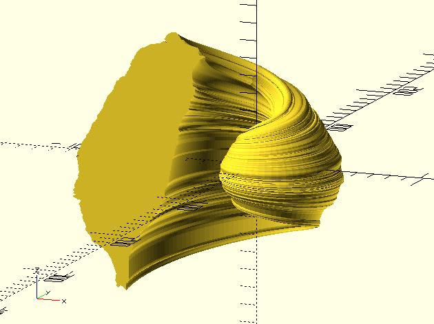
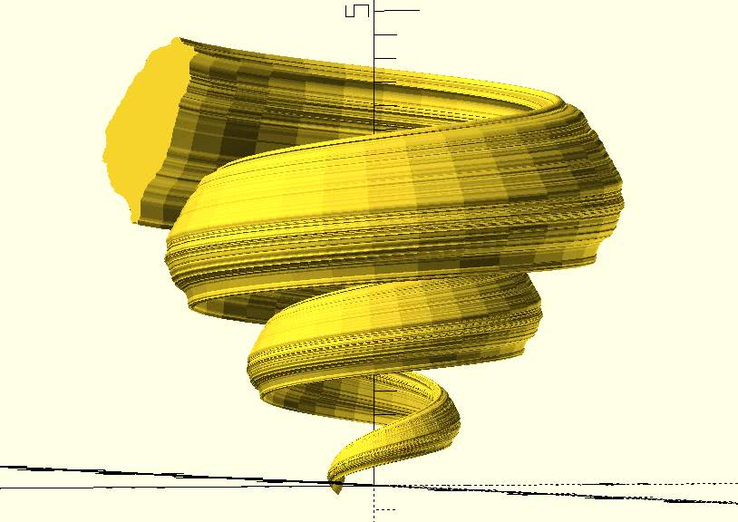

# shape_taiwan

Returns shape points of [Taiwan](https://www.google.com.tw/maps?q=taiwan&um=1&ie=UTF-8&sa=X&ved=0ahUKEwjai9XrqurTAhVIopQKHbEHClwQ_AUICygC). They can be used with xxx_extrude modules of dotSCAD. The shape points can be also used with the built-in polygon module. 

## Parameters

- `h` : The height of Taiwan.
- `distance` : Used for simplifying the shape. If the distance between a point and its previous points is not greater than `distance`, the point will be kept. Default to 0. **Since:** 1.3.

## Examples

	use <shape_taiwan.scad>;

	polygon(shape_taiwan(10));

	use <shape_taiwan.scad>;
	use <golden_spiral_extrude.scad>;

	mirror_taiwan = [for(pt = shape_taiwan(15)) [pt[0] * -1, pt[1]]];

	golden_spiral_extrude(
		mirror_taiwan, 
		from = 1,  
		to = 10, 
		point_distance = 2.5,
		scale = 10
	);

	use <shape_taiwan.scad>;
	use <helix_extrude.scad>;

	r1 = 15;
	r2 = 100;
	levels = 3;
	level_dist = 50;

	helix_extrude(shape_taiwan(80), 
		radius = [r1, r2], 
		levels = levels, 
		level_dist = level_dist,
		vt_dir = "SPI_DOWN",
		rt_dir = "CLK",
		scale = 0.1
	);

