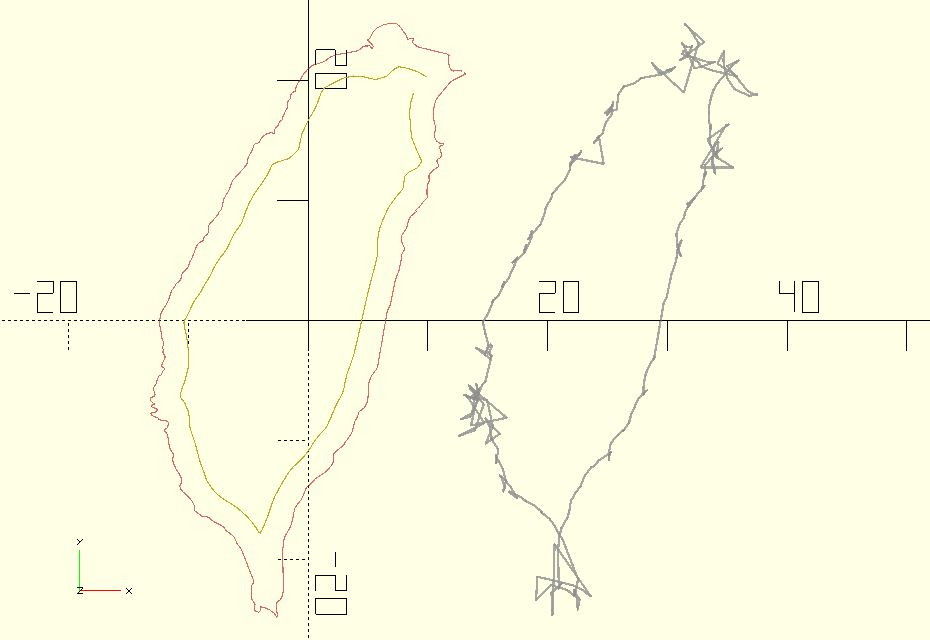

# trim_shape

Given a tangled-edge shape. This function trims the shape to a non-tangled shape. It's intended to be a helper function after using `bijection_offset`. 

**Since:** 1.3.

## Parameters

- `shape_pts` : The shape points.
- `from` : The index of the start point you want to trim.
- `to` : The index of the last point you want to trim.
- `epsilon` : An upper bound on the relative error due to rounding in floating point arithmetic. Default to 0.0001.

## Examples

    use <hull_polyline2d.scad>;
    use <trim_shape.scad>;
    use <shape_taiwan.scad>;
    use <bijection_offset.scad>;
    use <midpt_smooth.scad>;

    taiwan = shape_taiwan(50);
    offseted = bijection_offset(taiwan, -2);
    trimmed = trim_shape(offseted, 3, len(offseted) - 6);
    smoothed = midpt_smooth(trimmed, 3);

    #hull_polyline2d(taiwan, .1); 
    %translate([25, 0, 0]) 
        hull_polyline2d(offseted, .2);
    hull_polyline2d(smoothed, .1); 

