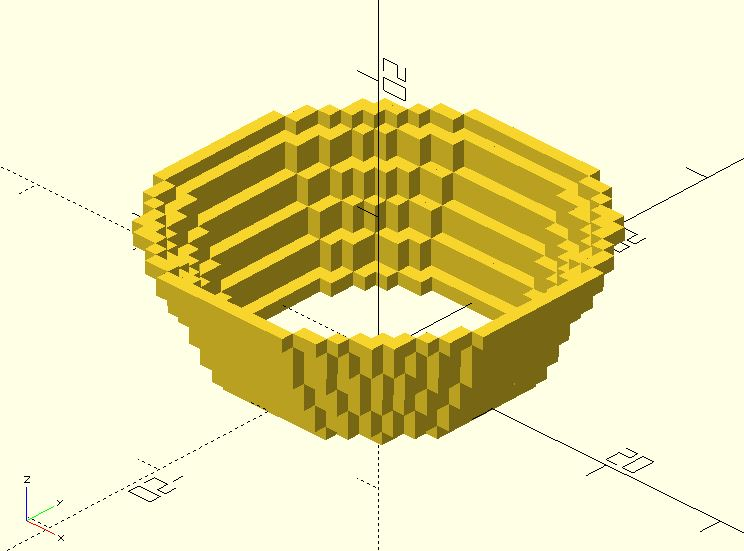
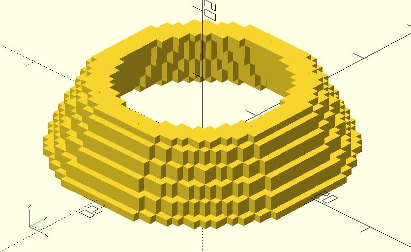

# vx_cylinder

Returns points that can be used to draw a voxel-style cylinder.

**Since:** 2.4

## Parameters

- `radius` : The radius of the cylinder. It also accepts a vector `[r1, r2]`. `r1` is the bottom radius and `r2` is the top radius of a cone. Values must be an integer.
- `h` : The height of the cylinder or cone. 
- `filled` : Default to `false`. Set it `true` if you want a filled cylinder.
- `thickness`: Default to 1. The thickness when `filled` is `false`. The value must be an integer.

## Examples

	use <voxel/vx_cylinder.scad>;

	for(pt = vx_cylinder([10, 15], 10)) {
		translate(pt)
			cube(1, center = true);
	}

	use <voxel/vx_cylinder.scad>;

	for(pt = vx_cylinder([20, 15], h = 10, thickness = 3)) {
		translate(pt)
			cube(1, center = true);
	}
	

